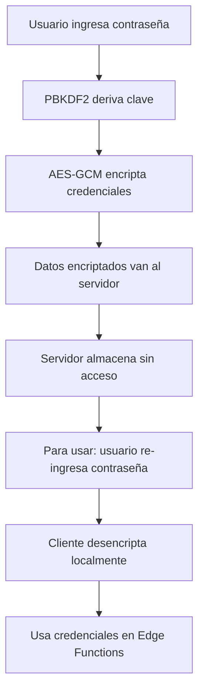

# Sistema de Gestión de Conexiones API

## Descripción General

El sistema de gestión de conexiones API es una solución completa de **zero-knowledge encryption** que permite a los usuarios administrar conexiones seguras a múltiples APIs externas (Supabase, Smartsheet, MongoDB) desde el panel de administración.

## Características Principales

### 🔒 Seguridad Zero-Knowledge

- **Encriptación del lado del cliente**: Las credenciales nunca se almacenan en texto plano en el servidor
- **PBKDF2 + AES-GCM**: Utiliza estándares de encriptación robustos
- **Contraseña maestra**: Solo el usuario conoce la contraseña para desencriptar credenciales
- **100,000+ iteraciones PBKDF2**: Protección contra ataques de fuerza bruta

### 🔌 APIs Soportadas

1. **Supabase**
   - URL del proyecto
   - Clave de API (anon/service)
2. **Smartsheet**
   - Token de acceso
   - Workspace ID (opcional)
3. **MongoDB**
   - URI de conexión
   - Base de datos
   - Colección

### 🛠 Funcionalidades

#### Gestión de Conexiones

- ✅ Crear nuevas conexiones
- ✅ Editar conexiones existentes
- ✅ Eliminar conexiones
- ✅ Probar conectividad
- ✅ Ver estado de conexiones

#### Respaldo y Restauración

- ✅ Exportar conexiones encriptadas
- ✅ Importar desde respaldos
- ✅ Validación de integridad
- ✅ Compatibilidad entre versiones

#### Mapeo de Columnas

- ✅ Descubrimiento automático de esquemas
- ✅ Mapeo visual campo a campo
- ✅ Validación de campos requeridos
- ✅ Previsualización de datos

## Arquitectura del Sistema

### Componentes Frontend

#### 1. Servicios de Encriptación (`src/services/encryptionService.js`)

```javascript
// Funciones principales:
-generateSalt() - // Genera sal criptográfica
  deriveKey() - // Deriva clave desde contraseña
  encrypt() - // Encripta datos con AES-GCM
  decrypt() - // Desencripta datos
  validatePassword() - // Valida fortaleza de contraseña
  exportConnection() - // Crea respaldo encriptado
  importConnection(); // Restaura desde respaldo
```

#### 2. Servicios de Conexión (`src/services/connectionService.js`)

```javascript
// Funciones principales:
-createConnection() - // Crea nueva conexión
  updateConnection() - // Actualiza conexión existente
  deleteConnection() - // Elimina conexión
  testConnection() - // Prueba conectividad
  getTableSchema() - // Obtiene esquema de tabla
  exportConnection() - // Exporta para respaldo
  importConnection(); // Importa desde respaldo
```

#### 3. Interfaz de Usuario

- **GestionConexiones.jsx**: Página principal de gestión
- **ColumnMapping.jsx**: Componente de mapeo de columnas
- **SidebarSections.jsx**: Navegación del sidebar

### Componentes Backend

#### 1. Base de Datos (`sql/create_data_connections_table.sql`)

```sql
-- Tabla principal para almacenar conexiones
CREATE TABLE data_connections (
  id UUID PRIMARY KEY,
  user_id UUID REFERENCES auth.users,
  name VARCHAR(255) NOT NULL,
  type VARCHAR(50) NOT NULL,
  description TEXT,
  encrypted_credentials TEXT NOT NULL,  -- Credenciales encriptadas
  connection_status VARCHAR(20),
  last_tested_at TIMESTAMPTZ,
  created_at TIMESTAMPTZ DEFAULT NOW(),
  updated_at TIMESTAMPTZ DEFAULT NOW()
);
```

#### 2. Edge Functions

##### `test-api-connection` (`supabase/functions/test-api-connection/index.ts`)

- Prueba conectividad con APIs externas
- Valida credenciales sin almacenarlas
- Retorna estado de conexión

##### `get-table-schema` (`supabase/functions/get-table-schema/index.ts`)

- Obtiene esquemas de tablas/colecciones
- Extrae metadatos de columnas
- Soporta múltiples tipos de API

### Flujo de Seguridad



## Configuración e Instalación

### 1. Requisitos Previos

- Supabase proyecto configurado
- Node.js 18+ instalado
- Variables de entorno configuradas

### 2. Instalación de Base de Datos

```sql
-- Ejecutar en Supabase SQL Editor
\i sql/create_data_connections_table.sql
```

### 3. Desplegar Edge Functions

```bash
# Desde directorio del proyecto
supabase functions deploy test-api-connection
supabase functions deploy get-table-schema
```

### 4. Configurar Variables de Entorno

```bash
# En Supabase Dashboard > Project Settings > Edge Functions
SUPABASE_URL=your_supabase_url
SUPABASE_ANON_KEY=your_anon_key
```

## Uso del Sistema

### 1. Crear Nueva Conexión

1. Ir a "Conexiones API" en el sidebar
2. Hacer clic en "Nueva Conexión"
3. Seleccionar tipo de API
4. Ingresar credenciales
5. Establecer contraseña maestra
6. Guardar conexión

### 2. Probar Conexión

1. En la lista de conexiones, hacer clic en el botón "▶️"
2. Ingresar contraseña maestra
3. El sistema probará la conectividad automáticamente

### 3. Mapear Columnas

1. Seleccionar una conexión válida
2. Usar el componente ColumnMapping
3. Mapear campos externos a campos internos
4. Validar que todos los campos requeridos estén mapeados

### 4. Respaldar/Restaurar

```javascript
// Exportar conexión
const backup = await ConnectionService.exportConnection(connectionId, password);

// Importar conexión
await ConnectionService.importConnection(backupData, password);
```

## Consideraciones de Seguridad

### ✅ Implementado

- Encriptación zero-knowledge del lado del cliente
- Contraseñas nunca enviadas al servidor
- Validación robusta de contraseñas
- Salt único por usuario
- Edge Functions para aislamiento de credenciales
- Row Level Security (RLS) en base de datos

### 🔒 Mejores Prácticas

- Usar contraseñas fuertes (12+ caracteres)
- Crear respaldos regulares
- No compartir contraseñas maestras
- Rotar credenciales de API periódicamente
- Monitorear logs de acceso

### ⚠️ Limitaciones

- Si se pierde la contraseña maestra, no hay forma de recuperar credenciales
- Las credenciales se desencriptan en memoria durante el uso
- Requiere Edge Functions habilitadas en Supabase

## API Reference

### EncryptionService

#### `encrypt(data, password)`

Encripta datos usando PBKDF2 + AES-GCM

```javascript
const encrypted = EncryptionService.encrypt(
  JSON.stringify(credentials),
  userPassword
);
```

#### `decrypt(encryptedData, password)`

Desencripta datos

```javascript
const decrypted = EncryptionService.decrypt(encryptedData, userPassword);
const credentials = JSON.parse(decrypted);
```

### ConnectionService

#### `createConnection(connectionData, password)`

Crea nueva conexión

```javascript
await ConnectionService.createConnection(
  {
    name: "Mi Supabase",
    type: "supabase",
    description: "Conexión de producción",
    credentials: { url: "...", key: "..." },
  },
  password
);
```

#### `testConnection(connectionId, password)`

Prueba conectividad

```javascript
const result = await ConnectionService.testConnection(connectionId, password);
console.log(result.success, result.message);
```

## Troubleshooting

### Problemas Comunes

#### 1. Error "Contraseña incorrecta"

- Verificar que la contraseña sea exactamente la misma
- Revisar que no haya espacios adicionales
- Comprobar configuración de teclado

#### 2. Edge Functions no responden

- Verificar que estén desplegadas: `supabase functions list`
- Revisar logs: `supabase functions logs test-api-connection`
- Confirmar variables de entorno

#### 3. Problemas de CORS

- Las Edge Functions incluyen headers CORS automáticamente
- Verificar configuración de Supabase

### Logs y Debugging

```bash
# Ver logs de Edge Functions
supabase functions logs test-api-connection --follow
supabase functions logs get-table-schema --follow

# Debug en navegador
console.log('Connection test result:', result);
```

## Roadmap Futuro

### Próximas Características

- [ ] Soporte para más APIs (PostgreSQL, MySQL, REST APIs)
- [ ] Sincronización automática programada
- [ ] Auditoría de accesos
- [ ] Autenticación multifactor
- [ ] Compartir conexiones entre usuarios (con re-encriptación)
- [ ] API rate limiting y throttling
- [ ] Dashboard de métricas de uso

### Mejoras de Seguridad

- [ ] Rotación automática de credenciales
- [ ] Detección de credenciales comprometidas
- [ ] Integración con vaults externos (HashiCorp Vault)
- [ ] Firma digital de respaldos

## Contribución

Para contribuir al sistema:

1. Fork del repositorio
2. Crear rama feature: `git checkout -b feature/nueva-api`
3. Implementar cambios siguiendo patrones existentes
4. Agregar tests de seguridad
5. Enviar pull request

### Estándares de Código

- ESLint configurado para React
- Comentarios JSDoc obligatorios
- Tests unitarios para funciones de encriptación
- Validación de entrada en todas las funciones

---

**Nota**: Este sistema maneja credenciales sensibles. Siempre seguir las mejores prácticas de seguridad y realizar auditorías regulares.
