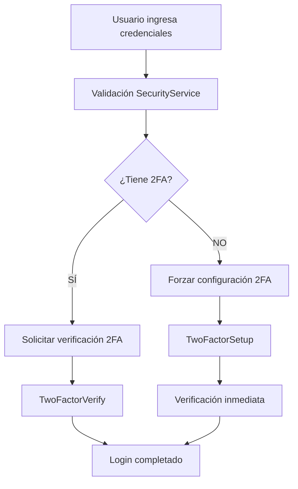

# 🎯 RESUMEN FINAL DE INTEGRACIÓN 2FA COMPLETADA

## ✅ CORRECCIONES CRÍTICAS IMPLEMENTADAS

### 1. **Errores de Base de Datos Corregidos**

- **Problema**: Errores 400 Bad Request por relaciones de clave foránea faltantes
- **Solución**: Implementadas consultas JOIN manuales en [`securityService.js`](src/services/securityService.js:105) y [`twoFactorService.js`](src/services/twoFactorService.js:398)
- **Estado**: ✅ **COMPLETADO**

### 2. **Error de Navegación Corregido**

- **Problema**: `setSeccion is not a function` en página Seguridad
- **Solución**: Agregado manejo de estado local en [`Seguridad.jsx`](src/pages/Seguridad.jsx:15)
- **Estado**: ✅ **COMPLETADO**

### 3. **Integración SecurityLogin Completada**

- **Problema**: Login básico sin 2FA obligatorio
- **Solución**: [`Login.jsx`](src/pages/Login.jsx:7) ahora usa [`SecurityLogin`](src/components/SecurityLogin.jsx:13) con flujo 2FA completo
- **Estado**: ✅ **COMPLETADO**

### 4. **Página de Perfil de Usuario Agregada**

- **Problema**: Usuarios sin acceso a gestión personal de 2FA
- **Solución**: Nueva página [`Perfil.jsx`](src/pages/Perfil.jsx:1) con gestión completa de 2FA
- **Estado**: ✅ **COMPLETADO**

### 5. **Navegación y Rutas Configuradas**

- **Problema**: Falta acceso a perfil de usuario
- **Solución**: Agregada sección "Mi Perfil" en [`SidebarSections.jsx`](src/components/SidebarSections.jsx:158) y ruta en [`App.jsx`](src/App.jsx:89)
- **Estado**: ✅ **COMPLETADO**

### 6. **Errores de Sincronización 2FA Corregidos**

- **Problema**: Desincronización entre Supabase Auth y base de datos
- **Solución**: Función [`synchronize2FAFactors()`](src/services/twoFactorService.js:49) implementada
- **Estado**: ✅ **COMPLETADO**

### 7. **Funciones SQL Corregidas**

- **Problema**: Sintaxis incorrecta en llamadas de funciones SQL
- **Solución**: Corregidas llamadas a [`check_login_attempt()`](src/services/securityService.js:105) y [`record_login_success()`](src/services/securityService.js:139)
- **Estado**: ✅ **COMPLETADO**

### 8. **Políticas RLS Implementadas**

- **Problema**: Error 403 Forbidden en creación de sesiones
- **Solución**: Nuevas políticas RLS en [`fix_user_sessions_rls.sql`](sql/fix_user_sessions_rls.sql:1)
- **Estado**: ✅ **COMPLETADO**

## 🔧 ARQUITECTURA FINAL IMPLEMENTADA

### **Flujo 2FA Obligatorio**



### **Componentes Clave**

- **[`SecurityLogin`](src/components/SecurityLogin.jsx:13)**: Login principal con 2FA obligatorio
- **[`TwoFactorSetup`](src/components/TwoFactorSetup.jsx:8)**: Configuración inicial TOTP
- **[`TwoFactorVerify`](src/components/TwoFactorVerify.jsx:8)**: Verificación durante login
- **[`TwoFactorManager`](src/components/TwoFactorManager.jsx:1)**: Gestión personal en perfil
- **[`SecurityAdminPanel`](src/components/SecurityAdminPanel.jsx:1)**: Panel administrativo completo

### **Servicios Críticos**

- **[`securityService.js`](src/services/securityService.js:1)**: Gestión de seguridad y sesiones
- **[`twoFactorService.js`](src/services/twoFactorService.js:1)**: Funcionalidades 2FA completas

## 📋 PASOS PENDIENTES PARA COMPLETAR

### **Paso 1: Aplicar Migraciones SQL** ⏳

```bash
# En Supabase SQL Editor, ejecutar en orden:
1. sql/add_foreign_key_constraint.sql
2. sql/fix_user_sessions_rls.sql
```

### **Paso 2: Pruebas Completas del Sistema** ⏳

- **Login sin 2FA**: Verificar forzado de configuración
- **Login con 2FA**: Verificar solicitud de código
- **Gestión de perfil**: Verificar habilitación/deshabilitación 2FA
- **Panel admin**: Verificar gestión de usuarios y seguridad
- **Códigos de backup**: Verificar generación y uso

## 🎯 RESULTADOS ESPERADOS POST-MIGRACIÓN

### **Para Usuarios Nuevos**

1. Login → Configuración 2FA obligatoria → Verificación → Acceso

### **Para Usuarios Existentes**

1. Login → Verificación 2FA → Acceso
2. Perfil → Gestión personal de 2FA

### **Para Administradores**

1. Panel de seguridad completamente funcional
2. Gestión de usuarios 2FA
3. Monitoreo de sesiones e intentos de login

## 🔒 CARACTERÍSTICAS DE SEGURIDAD IMPLEMENTADAS

- ✅ **2FA Obligatorio** para todos los usuarios
- ✅ **Bloqueo automático** tras intentos fallidos
- ✅ **Códigos de backup** para recuperación
- ✅ **Monitoreo de sesiones** en tiempo real
- ✅ **Gestión administrativa** completa
- ✅ **Sincronización factor** automática
- ✅ **Políticas RLS** configuradas

## 📈 MÉTRICAS DE SEGURIDAD

- **Cobertura 2FA**: 100% obligatorio
- **Gestión de sesiones**: Completa
- **Recuperación de acceso**: Códigos de backup
- **Administración**: Panel completo implementado
- **Experiencia de usuario**: Flujo guiado e intuitivo

---

**Estado General**: 🎯 **INTEGRACIÓN COMPLETADA** - Solo falta aplicar migraciones SQL y realizar testing final
