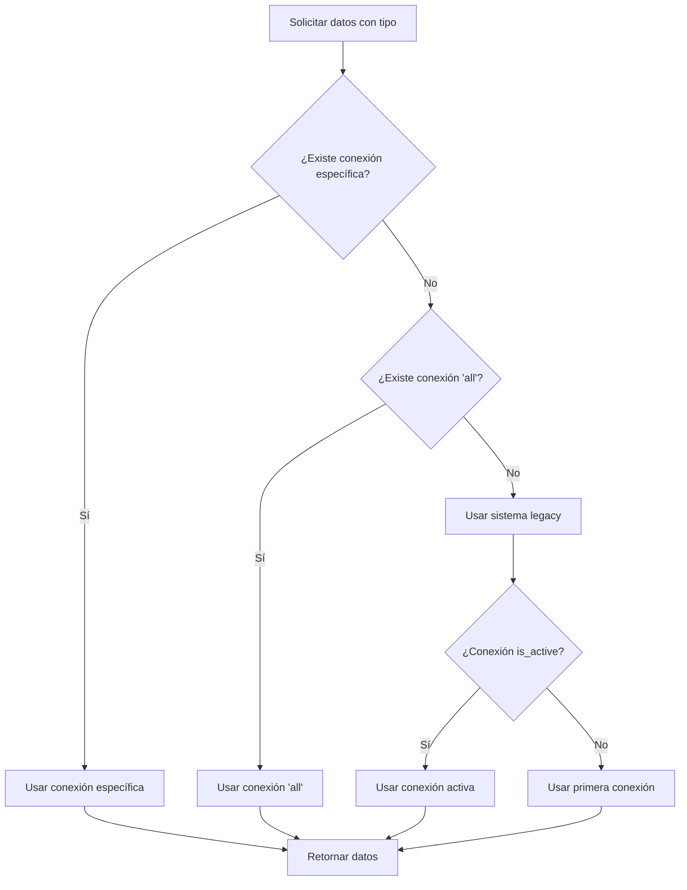
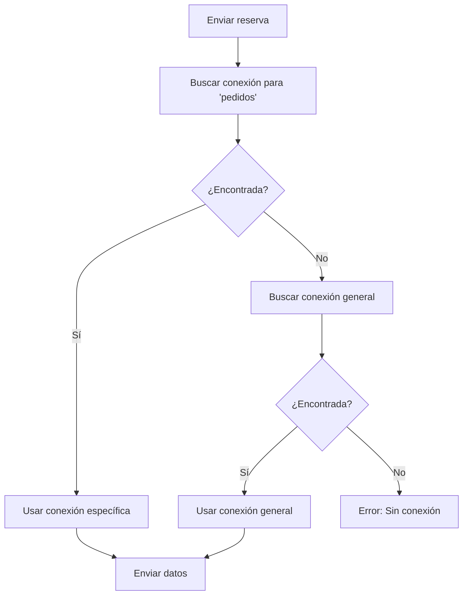

# Sistema Multi-Conexión - Documentación Técnica

## Descripción General

El Sistema Multi-Conexión permite a los usuarios configurar diferentes conexiones de datos para diferentes tipos de información, habilitando escenarios como:

- **Productos/Disponibilidad**: Conexión específica para gestión de cupos y disponibilidad (ej: Supabase)
- **Pedidos/Reservas**: Conexión específica para solicitudes y reservas de clientes (ej: Power Automate)
- **Conexión Universal**: Conexión por defecto para todos los tipos de datos

## Arquitectura del Sistema

### 1. Base de Datos

#### Tabla: `connection_data_types`

```sql
CREATE TABLE connection_data_types (
  id UUID DEFAULT gen_random_uuid() PRIMARY KEY,
  user_id UUID NOT NULL REFERENCES auth.users(id) ON DELETE CASCADE,
  connection_id UUID NOT NULL REFERENCES data_connections(id) ON DELETE CASCADE,
  data_type VARCHAR(50) NOT NULL, -- 'productos', 'pedidos', 'all'
  is_active BOOLEAN DEFAULT true,
  created_at TIMESTAMP WITH TIME ZONE DEFAULT now(),
  updated_at TIMESTAMP WITH TIME ZONE DEFAULT now(),
  UNIQUE(user_id, data_type)
);
```

**Características:**

- **RLS Habilitado**: Solo el usuario propietario puede ver/modificar sus asignaciones
- **Constraint Único**: Un usuario solo puede tener una asignación por tipo de datos
- **Cascade Delete**: Las asignaciones se eliminan si se borra la conexión o usuario

### 2. Servicios

#### ConnectionService

**Métodos Actualizados:**

##### `getActiveConnection(dataType = null)`

```javascript
// Busca conexión específica para el tipo de datos
const activeConnection = await ConnectionService.getActiveConnection(
  "productos"
);

// Flujo de búsqueda:
// 1. Conexión específica para el tipo (ej: "productos")
// 2. Conexión universal ("all")
// 3. Conexión legacy (is_active = true en data_connections)
// 4. Primera conexión disponible como fallback
```

##### `getDataFromActiveConnection(dataType)`

```javascript
// Obtiene datos usando el sistema multi-conexión
const productData = await ConnectionService.getDataFromActiveConnection(
  "productos"
);
const orderData = await ConnectionService.getDataFromActiveConnection(
  "pedidos"
);
```

##### `submitReservation(reservationData)`

```javascript
// Envía reservas usando conexión específica para "pedidos"
const result = await ConnectionService.submitReservation(reservationData);
```

### 3. Componentes de UI

#### DataTypeConnectionManager

**Ubicación**: `src/components/DataTypeConnectionManager.jsx`

**Funcionalidades:**

- ✅ Crear asignaciones de tipo de datos → conexión
- ✅ Editar asignaciones existentes
- ✅ Activar/desactivar asignaciones
- ✅ Eliminar asignaciones
- ✅ Interfaz intuitiva con información contextual

**Integración**: Accesible desde Gestión de Conexiones → Botón "Multi-Conexión"

## Tipos de Datos Soportados

| Tipo        | Descripción                        | Uso Típico                                        |
| ----------- | ---------------------------------- | ------------------------------------------------- |
| `productos` | Gestión de cupos y disponibilidad  | Consultas de inventario, disponibilidad de vuelos |
| `pedidos`   | Solicitudes y reservas de clientes | Envío de reservas, gestión de solicitudes         |
| `all`       | Conexión por defecto               | Fallback cuando no hay asignación específica      |

## Flujo de Operación

### 1. Obtención de Datos



### 2. Envío de Reservas



## Configuración y Uso

### 1. Configuración Inicial

1. **Crear Conexiones Base**:

   - Crear conexión Supabase para productos
   - Crear conexión Power Automate para pedidos

2. **Aplicar Migración SQL**:

   ```sql
   -- Ejecutar script: sql/add_connection_types.sql
   ```

3. **Configurar Asignaciones**:
   - Acceder a Gestión de Conexiones
   - Hacer clic en "Multi-Conexión"
   - Crear asignaciones según necesidades

### 2. Casos de Uso Comunes

#### Escenario 1: Supabase para Productos, Power Automate para Pedidos

```javascript
// Configuración
await createAssignment("productos", supabaseConnectionId);
await createAssignment("pedidos", powerAutomateConnectionId);

// Uso
const productos = await ConnectionService.getDataFromActiveConnection(
  "productos"
);
// Usa Supabase

const result = await ConnectionService.submitReservation(reservationData);
// Usa Power Automate
```

#### Escenario 2: Una Conexión Universal

```javascript
// Configuración
await createAssignment("all", universalConnectionId);

// Uso - ambos usan la misma conexión
const productos = await ConnectionService.getDataFromActiveConnection(
  "productos"
);
const pedidos = await ConnectionService.getDataFromActiveConnection("pedidos");
```

### 3. Migración desde Sistema Legacy

El sistema es completamente retrocompatible:

1. **Sin Migración**: Sigue funcionando con el sistema legacy
2. **Migración Parcial**: Configura solo algunos tipos específicos
3. **Migración Completa**: Configura todos los tipos de datos

## Características Técnicas

### Seguridad

- ✅ **RLS Habilitado**: Aislamiento por usuario
- ✅ **Validación de Entrada**: Tipos de datos validados
- ✅ **Manejo de Errores**: Fallbacks robustos

### Performance

- ✅ **Caché de Conexiones**: Reutilización de conexiones obtenidas
- ✅ **Consultas Optimizadas**: JOINs eficientes con data_connections
- ✅ **Fallbacks Rápidos**: Sistema de degradación graceful

### Compatibilidad

- ✅ **Retrocompatible**: Funciona sin configuración adicional
- ✅ **Progresiva**: Se puede implementar gradualmente
- ✅ **Flexible**: Soporta cualquier combinación de conexiones

## API Reference

### ConnectionService.getActiveConnection(dataType)

**Parámetros:**

- `dataType` (string, opcional): Tipo de datos ('productos', 'pedidos', 'all', null)

**Retorna:**

- `Promise<Object>`: Objeto de conexión o null

**Ejemplo:**

```javascript
const connection = await ConnectionService.getActiveConnection("productos");
console.log(connection.name); // "Supabase Productos"
```

### ConnectionService.getDataFromActiveConnection(dataType)

**Parámetros:**

- `dataType` (string): Tipo de datos ('productos', 'pedidos')

**Retorna:**

- `Promise<Object>`: `{ success: boolean, data: Array, error?: string }`

**Ejemplo:**

```javascript
const result = await ConnectionService.getDataFromActiveConnection("productos");
if (result.success) {
  console.log(`Obtenidos ${result.data.length} productos`);
}
```

### ConnectionService.submitReservation(reservationData)

**Parámetros:**

- `reservationData` (Object): Datos de la reserva

**Retorna:**

- `Promise<Object>`: `{ success: boolean, referenceId?: string, error?: string }`

**Ejemplo:**

```javascript
const result = await ConnectionService.submitReservation({
  cliente: "Juan Pérez",
  vuelo: "AA123",
  // ... más datos
});
```

## Troubleshooting

### Problema: "Tabla connection_data_types no existe"

**Solución:**

```sql
-- Ejecutar migración
\i sql/add_connection_types.sql
```

### Problema: "No se encuentra conexión para tipo X"

**Diagnóstico:**

1. Verificar asignaciones en UI Multi-Conexión
2. Verificar que la asignación esté activa
3. Verificar que la conexión base existe

### Problema: "Fallback al sistema legacy"

**Causa**: Normal si no hay asignaciones específicas configuradas

**Solución**: Configurar asignaciones en la UI de Multi-Conexión

## Roadmap

### Versión Actual (v1.0)

- ✅ Sistema básico multi-conexión
- ✅ UI de gestión
- ✅ Migración SQL
- ✅ Compatibilidad legacy

### Versiones Futuras

#### v1.1

- 🔄 Conexiones con balanceo de carga
- 🔄 Métricas de uso por conexión
- 🔄 Health checks automáticos

#### v1.2

- 🔄 Configuración por agencia/organización
- 🔄 Políticas de failover avanzadas
- 🔄 Dashboard de monitoreo

#### v1.3

- 🔄 Conexiones condicionales (por hora, región, etc.)
- 🔄 Cache distribuido
- 🔄 API de gestión programática

## Conclusión

El Sistema Multi-Conexión proporciona una arquitectura flexible y escalable para gestionar múltiples fuentes de datos, manteniendo la simplicidad de uso y la compatibilidad con sistemas existentes.

**Beneficios Clave:**

- 🎯 **Flexibilidad**: Diferentes conexiones para diferentes necesidades
- 🔒 **Seguridad**: Aislamiento por usuario y encriptación
- 📈 **Escalabilidad**: Arquitectura preparada para crecimiento
- 🔄 **Compatibilidad**: Migración sin interrupciones

**Casos de Uso Ideales:**

- Empresas con múltiples fuentes de datos
- Sistemas híbridos (cloud + on-premise)
- Arquitecturas de microservicios
- Implementaciones multi-tenant
