Este documento describe cada funcionalidad del **Sistema de Gestión de Cupos** junto con su diagrama de flujo. Cada sección incluye una breve descripción textual y un diagrama que refleja la lógica real implementada en el repositorio (validaciones, estados y endpoints).

> Secciones 1-16 sin re-verificar en la pasada del 2026-08-10 (se asume su contenido previo vigente); sección 17 agregada y verificada ese día; sección 18 agregada y verificada el 2026-08-12; sección 19 agregada y verificada el 2026-08-13.


## Índice

1. [Autenticación y Login con JWT y RBAC](#1-autenticación-y-login-con-jwt-y-rbac)
2. [Disponibilidad y Creación de Reserva](#2-disponibilidad-y-creación-de-reserva)
3. [Ciclo de Vida de la Reserva](#3-ciclo-de-vida-de-la-reserva)
4. [Solicitudes y Confirmaciones](#4-solicitudes-y-confirmaciones)
5. [Cesión de Cupos entre Agencias](#5-cesión-de-cupos-entre-agencias)
6. [Grupos y Vuelos a Medida](#6-grupos-y-vuelos-a-medida)
7. [Gestión de Productos](#7-gestión-de-productos)
8. [Gestión de Nóminas](#8-gestión-de-nóminas)
9. [RBAC Usuarios Roles y Permisos](#9-rbac-usuarios-roles-y-permisos)
10. [Asistente IA](#10-asistente-ia)
11. [Expiración Automática de Reservas](#11-expiración-automática-de-reservas)
12. [Reportes y Dashboard](#12-reportes-y-dashboard)
13. [Notificaciones](#13-notificaciones)
14. [Configuraciones](#14-configuraciones)
15. [Claves de API para Integraciones Externas (M2M)](#15-claves-de-api-para-integraciones-externas-m2m)
16. [Estado del Sistema y Backups](#16-estado-del-sistema-y-backups)
17. [Integración con Netviax Atlas (Backoffice)](#17-integración-con-netviax-atlas-backoffice)
18. [Administración (módulo en construcción)](#18-administración-módulo-en-construcción)
19. [Oportunidades y Conversión a Producto](#19-oportunidades-y-conversión-a-producto)

---

## 1. Autenticación y Login con JWT y RBAC

El login valida las credenciales contra `Profile` (comparando el hash `bcrypt`), verifica que la cuenta esté activa y, si todo es correcto, firma un **JWT HS256** de 24 horas con los claims `id`, `email`, `agencia`, `role` y `admin`. En cada request protegida el `AuthMiddleware` valida el token y adjunta esos datos al contexto; `RequirePermission` gatea los endpoints sensibles.

La resolución de permisos **RBAC** ocurre una sola vez después del login: el frontend llama a `GET /users/me/permissions` para saber qué mostrar/habilitar. Un `admin` recibe **todos** los códigos activos (bypass total), mientras que el resto los obtiene navegando `user_roles → role_permissions → permissions`. El `Sidebar` filtra sus ítems de menú según esos códigos.

- Backend: `POST /api/auth/login` (`user_handler.go`), `GET /users/me/permissions` (`rbac_handler.go`), middleware `AuthMiddleware` / `RequirePermission` (`middleware/auth.go`).
- Frontend: `frontend/src/components/ui/Sidebar.jsx`.

**Decisión de producto ya tomada (2026-08-15), no implementada todavía**: en producción, el login va a hacerse vía **Office 365 / SSO corporativo** — no es una opción en evaluación, es el reemplazo decidido del login propio (usuario/contraseña) contra `Profile`. Sin diseño técnico ni código todavía (nada de OAuth/Azure AD/MSAL en el repo a la fecha de esta nota) — cuando se implemente, actualizar esta sección con el flujo real en vez de dar por sentado que sigue siendo bcrypt+JWT contra `Profile` para producción.

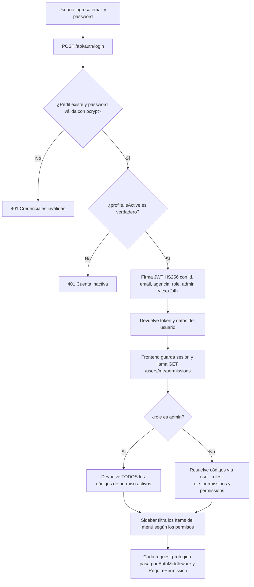

---

## 2. Disponibilidad y Creación de Reserva

La pantalla de **Disponibilidad** es el catálogo de vuelos reservables. El backend solo muestra productos con `disponibilidad > 0`, no bloqueados para venta y accesibles para la agencia (propios, cedidos vía `RestrictedAgency` o compartidos vía `ProductSharedAgency`). Desde ahí la agencia elige cuántos pasajeros va a cargar, y **recién ahí** se abre el formulario.

Antes de mostrar el formulario, el frontend llama a `POST /api/orders/hold` (`CreateHold`) con la cantidad de pasajeros — sin ningún dato de contacto todavía. Esto **ya descuenta `disponibilidad` y suma `vendidos`** (para que nadie más pueda tomar ese lugar mientras se completa el formulario) y crea una `Reservation` en estado **`hold_temporal`**, sin datos de pasajero, con su propio vencimiento corto: `bloqueo_hold_minutos` (setting por agencia, 10 minutos por defecto — bien distinto del `bloqueo_minutos_default` de una reserva real). Mientras el hold está activo, el modal muestra una cuenta regresiva (`CountdownTimer.jsx`); si el usuario cierra el modal sin confirmar, `DELETE /api/orders/hold/:id` libera el lugar al instante.

Al confirmar el formulario, `CreateReservation` recibe el `hold_id`. Si viene, valida que la cantidad de pasajeros no haya cambiado, **reutiliza la misma fila** (no vuelve a descontar `disponibilidad`/`vendidos`, ya se habían descontado en el hold) y la completa con los datos reales, arrancando ahí el vencimiento de `bloqueo_temporal` (`bloqueo_temporal_minutos` del producto o el setting `bloqueo_minutos_default`, 60 por defecto). Si se cargó `doc_contable` la reserva nace **confirmada**; si no, en **bloqueo_temporal**. Cada pasajero se crea como su propio ticket individual (1 lugar, 1 fila en `passengers`) y se calcula su `NRO`. Finalmente notifica al admin, avisa si la disponibilidad quedó baja y envía email a la agencia. (El asistente de IA puede crear una reserva directo, sin pasar por el hold — en ese caso descuenta el stock recién en `CreateReservation`.)

- Backend: `POST /api/orders/hold` → `CreateHold`, `DELETE /api/orders/hold/:id` → `ReleaseHold`, `POST /api/orders/` → `CreateReservation` (`order_handler.go`), `GET /api/products/` → `GetProducts` (`product_handler.go`).
- Frontend: `frontend/src/pages/Availability.jsx`, `CountdownTimer.jsx`; sección `DisponibilidadSection` en `Documentacion.jsx`.

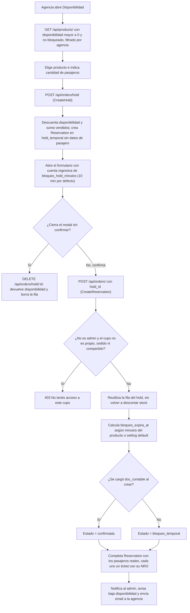

---

## 3. Ciclo de Vida de la Reserva

Una reserva se mueve por una máquina de estados. Los valores canónicos definidos en el backend (`models.go`) son: `hold_temporal`, `bloqueo_temporal`, `confirmada`, `solicitud_cancelacion`, `cancelada`, `expirada` y `cedido`. `hold_temporal` es un estado previo, sin datos de pasajero (ver sección 2) — se excluye explícitamente de los listados de reservas (`GET /api/orders`) para no aparecer como una reserva fantasma. La documentación de usuario (`ReservasSection` en `Documentacion.jsx`) además presenta visualmente el estado **`procesando`** (el operador tomó la solicitud y está emitiendo el ticket) y el badge **`cedido`** (cupo prestado por otra agencia).

Transiciones reales:
- **hold_temporal → bloqueo_temporal / confirmada**: al confirmar el formulario con `hold_id` (`CreateReservation`), según haya `doc_contable` o no.
- **hold_temporal → (se borra la fila)**: al cerrar el modal sin confirmar (`ReleaseHold`) o cuando el cron vence el hold (ver sección 11) — en ningún caso pasa por `expirada`, porque nunca llegó a ser una reserva real.
- **bloqueo_temporal → confirmada**: al cargar el documento contable (`AddDocContable`) o al confirmar (`ConfirmReservation`).
- **bloqueo_temporal → expirada**: el cron libera el cupo cuando vence `bloqueo_expira_at` (ver sección 11).
- **bloqueo_temporal → cancelada (directo, sin autorización)**: `RequestCancellation` detecta que la reserva todavía está en `bloqueo_temporal` — nadie más la confirmó — y cancela al instante, liberando el cupo, sin pasar por `solicitud_cancelacion`. Cambiado 2026-08-12; antes cualquier estado pasaba siempre por la aprobación de un admin.
- **confirmada (u otro estado post-confirmación) → solicitud_cancelacion**: `RequestCancellation` guarda el estado previo en `pre_cancel_estado` y sí requiere aprobación — ya es una reserva que alguien dio por confirmada.
- **solicitud_cancelacion → cancelada**: `ResolveCancellation` aprueba, libera el cupo y conserva la fila en el historial.
- **solicitud_cancelacion → estado previo**: `ResolveCancellation` rechaza y restaura `pre_cancel_estado`.

- Backend: `order_handler.go` (`CreateHold`, `ReleaseHold`, `AddDocContable`, `ConfirmReservation`, `RequestCancellation`, `ResolveCancellation`), `cron_handler.go`. Referencia de datos: `ESTRUCTURA_BD_GO.md`.

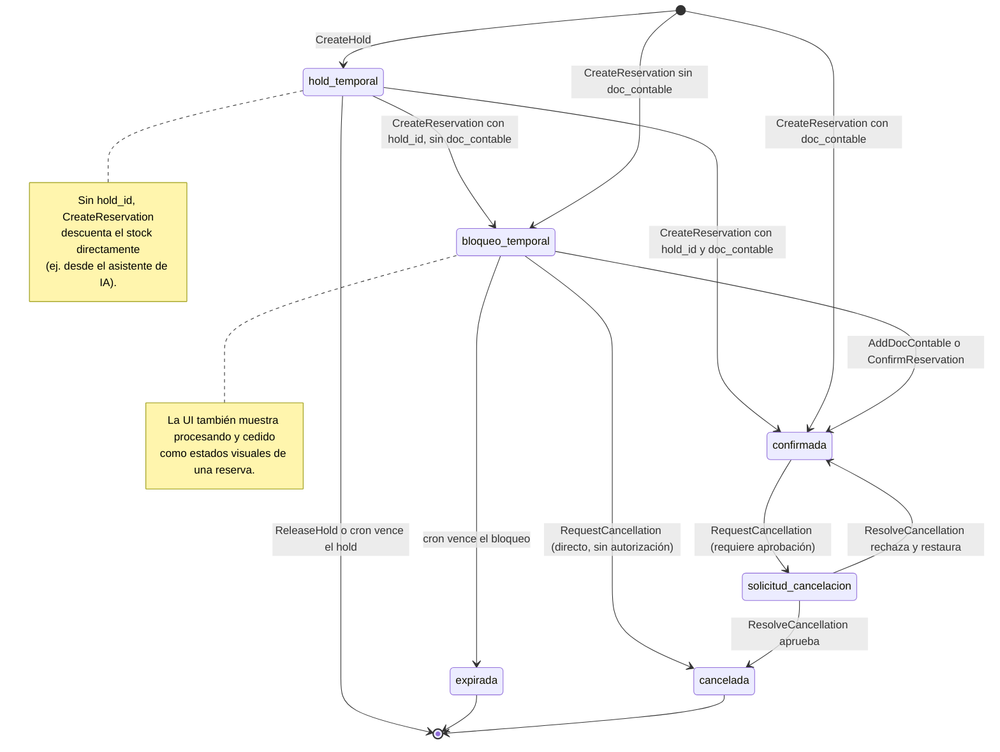

---

## 4. Solicitudes y Confirmaciones

Ambas vistas de agencia consumen el mismo endpoint `GET /api/orders/` (`GetAllReservations`, que ya filtra por rol/agencia) y separan las filas del lado del cliente en `reservationService.js`: **Solicitudes** excluye las reservas `confirmada` y `cedido`; **Confirmaciones** muestra solo las `confirmada`/`confirmado`.

En **Solicitudes** la agencia puede cargar el documento contable (que confirma la reserva), cancelar/solicitar la cancelación, y ve una cuenta regresiva mientras la reserva está en `bloqueo_temporal`. El botón de cancelar se comporta distinto según el estado: en `bloqueo_temporal` cancela directo sin pedir autorización (nadie más la confirmó todavía); en cualquier otro estado (`confirmada`, etc.) pasa por la solicitud de aprobación de siempre. En **Confirmaciones** puede solicitar la cancelación (ahí siempre requiere aprobación, porque todo lo que se lista ya está `confirmada`) y generar el **Itinerario PDF** (con la marca white-label de su agencia), obteniendo el detalle completo de pasajeros vía `GET /api/orders/:id`.

- Frontend: `frontend/src/pages/Requests.jsx`, `frontend/src/pages/Confirmations.jsx`, `frontend/src/services/reservationService.js`.

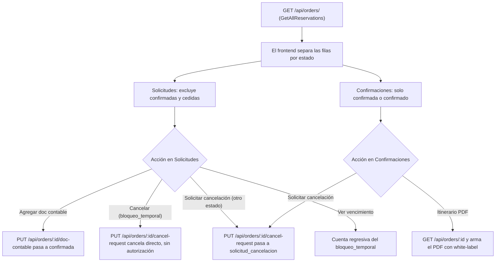

---

## 5. Cesión de Cupos entre Agencias

El operador (owner) o un admin puede **ceder (prestar) cupos** de un producto a otra agencia. `CreateTransfer` determina la agencia cedente (la dueña `Agencia`, o la `RestrictedAgency` si el producto ya es un espejo de una cesión previa), valida que origen y destino difieran y que haya disponibilidad suficiente. Luego, en una transacción: descuenta el stock del producto origen, crea un **producto espejo** restringido a la agencia destino (`RestrictedAgency`, `SourceAgency`, `TransferID`) y registra un `AvailabilityTransfer`. La agencia receptora reserva sobre ese espejo con normalidad.

Ceder o recuperar **no** genera reservas de auditoría: la trazabilidad queda en `AvailabilityTransfer`. `ReclaimTransfer` devuelve el stock disponible del espejo al producto original (total o parcial); los cupos ya reservados no se pueden recuperar.

- Backend: `POST /api/transfers` y `POST /api/transfers/:id/reclaim` (`transfer_handler.go`).
- Frontend: `CesionSection` en `Documentacion.jsx`, `components/TransferModal.jsx`.

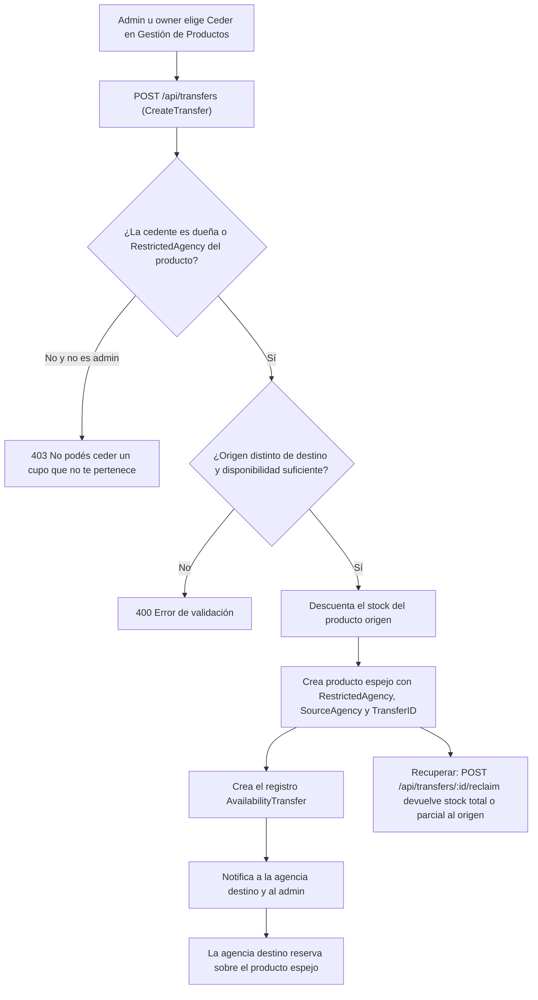

---

## 6. Grupos y Vuelos a Medida

Un **grupo** es un vuelo a medida que la agencia propone y el admin cotiza. Tiene una máquina de estados de **2 fases** (`models.go`):

- **Fase 1 — `EstadoCotizacion`**: `pendiente → cotizada → aceptada | rechazada`.
- **Fase 2 — `EstadoReservar`** (solo tras aceptar): `confirmada → cancelacion_solicitada → cancelada` (o vuelve a `confirmada` si se rechaza la cancelación).

La agencia crea la solicitud con una o más opciones de itinerario (`RequestGroup`, cada opción comparte `solicitud_id`). El admin completa la cotización y la envía explícitamente (`SendGroupQuote`, que exige condiciones, neto y vencimiento de cotización). La agencia acepta una opción (`AcceptGroupQuote`, no puede estar vencida; sus hermanas quedan `rechazada`). El admin confirma (`ConfirmGroup`, recién ahí se revelan nominación/emisión/gastos). La cancelación de un grupo confirmado se solicita y se resuelve (`RequestGroupCancellation` / `ResolveGroupCancellation`).

- Backend: `group_handler.go`, `models.go`.
- Frontend: `frontend/src/pages/GestionGrupos.jsx` (admin), `frontend/src/pages/Requests.jsx` (agencia).

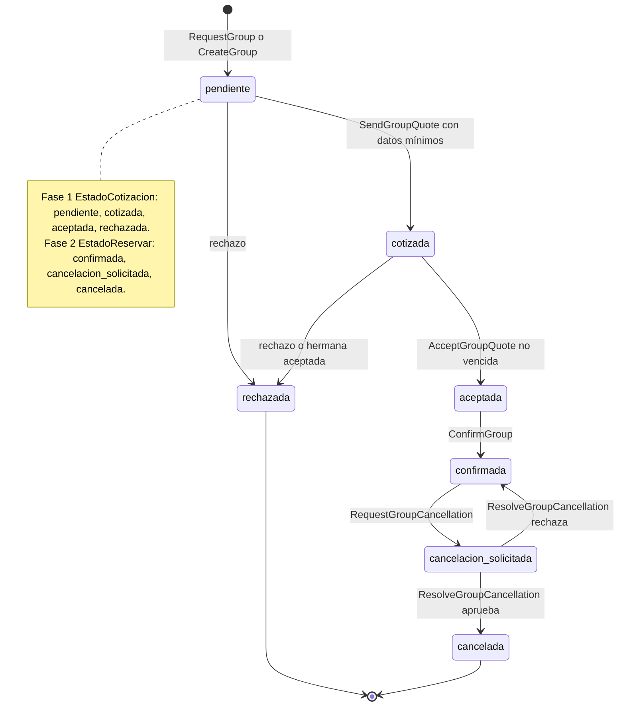

---

## 7. Gestión de Productos

Pantalla de administración del inventario (**cupos**/bloqueos aéreos). Permite el CRUD de productos (gateado por `PRODUCTS_CREATE/UPDATE/DELETE`), la **importación masiva desde Excel** (descarga de plantilla XLSX, carga y `POST /api/products/bulk` que procesa fila por fila reportando errores) y el **bloqueo de venta** (`is_blocked_for_sale`), que oculta el producto de Disponibilidad sin afectar reservas existentes.

El borrado se bloquea si el producto tiene reservas o cesiones asociadas. Desde acá también se accede a ceder/compartir cupos (ver sección 5).

- Backend: `product_handler.go` (`GetProducts`, `CreateProduct`, `UpdateProduct`, `DeleteProduct`, `BulkCreateProducts`).
- Frontend: `frontend/src/pages/GestionProductos.jsx`, `ProductosSection` en `Documentacion.jsx`, `components/ProductBulkUpload.jsx`.

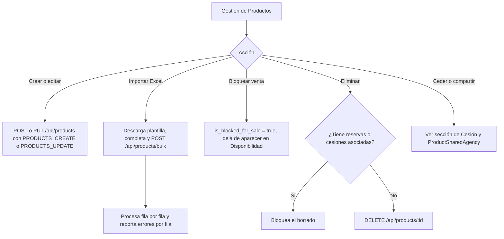

---

## 8. Gestión de Nóminas

La nómina es el **roster de pasajeros** por producto. Consume `GET /api/orders/` (con `Passengers` y `roster_product_id`) y agrupa cada pasajero por `roster_product_id`: si la venta se hizo sobre un producto-espejo cedido, la nómina real es la del producto **dueño** (la agencia que gestiona el vuelo), evitando fragmentar el roster.

Cada pasajero es un ticket individual: se le puede **asignar número de ticket** y precio de venta (`PUT /api/orders/:id/passengers/:passengerId`), editar todos sus datos (`.../full`), generar el **itinerario PDF** con marca white-label (requiere ticket asignado) y exportar el roster a XLSX.

- Backend: `order_handler.go` (`GetAllReservations`, `UpdatePassengerTicket`, `UpdatePassenger`).
- Frontend: `frontend/src/pages/GestionNominas.jsx`.

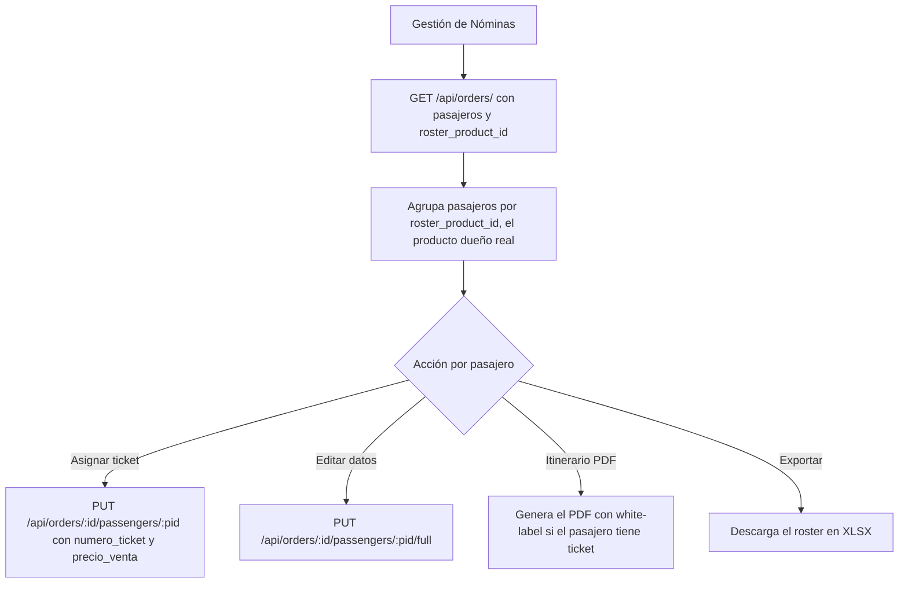

---

## 9. RBAC Usuarios Roles y Permisos

El control de acceso es granular y basado en códigos `MODULE_ACTION` (ej. `PRODUCTS_CREATE`, `RESERVATIONS_DELETE`). Los **permisos** son el catálogo de códigos; los **roles** agrupan permisos (`role_permissions`); los **usuarios** reciben un rol (`user_roles`). La gestión de cada entidad está gateada por sus propios permisos (`USERS_*`, `ROLES_*`, `PERMISSIONS_*`).

En tiempo de request, el middleware `RequirePermission(code)` deja pasar siempre al `admin` (bypass total) y, para el resto, verifica que exista el `code` activo recorriendo `user_roles → role_permissions → permissions`; si no, responde `403`.

- Backend: `middleware/auth.go` (`RequirePermission`), `rbac_handler.go`, `user_handler.go`, `services/rbac_service.go`.
- Frontend: `frontend/src/pages/GestionUsuarios.jsx`, `GestionRoles.jsx`, `GestionPermisos.jsx`.

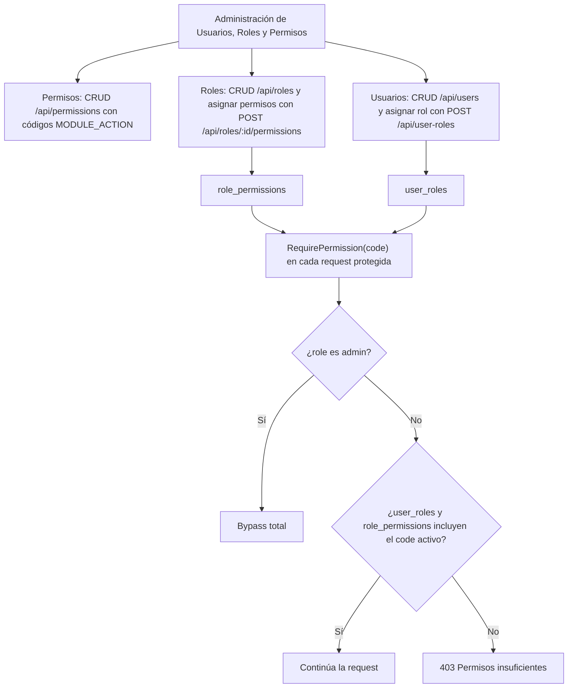

---

## 10. Asistente IA

El asistente (`POST /api/ai/chat`) arma un **system prompt** dinámico según el rol y los permisos granulares del usuario, con reglas de seguridad críticas: un usuario `user`/`agency_user` solo ve sus propias reservas y nunca datos financieros (neto, OP, rentabilidad) ni de otras agencias; `agency_admin` solo su agencia; `admin` todo. También recibe el **contexto de pantalla** (`pageContext`) para resolver referencias posicionales.

El backend expone un **toolset filtrado por rol** (con function calling sobre OpenAI/Anthropic/Google). Las herramientas son de lectura/acción sobre la DB (`buscar_productos`, `mis_reservas`, `crear_reserva`, `cotizar_grupo`, `rentabilidad`, etc.) o **UIActions** que instruyen al frontend (`abrir_modal_reserva`, `navegar_a_pantalla`, `completar_formulario_pasajeros`). El bucle llama al modelo, ejecuta las tools que pida respetando las reglas de seguridad, y repite hasta la respuesta final.

En el frontend, las respuestas del asistente se renderizan como **Markdown** (encabezados, listas, código y tablas) en vez de texto plano. Cuando el modelo usa `consultar_experto` para citar la base de conocimiento de un Experto, el contenido de cada documento cargado puede editarse manualmente desde el panel de Expertos — útil para corregir errores de OCR de un PDF escaneado sin tener que volver a subir el archivo.

- Backend: `backend-go/pkg/handlers/ai_handler.go`.

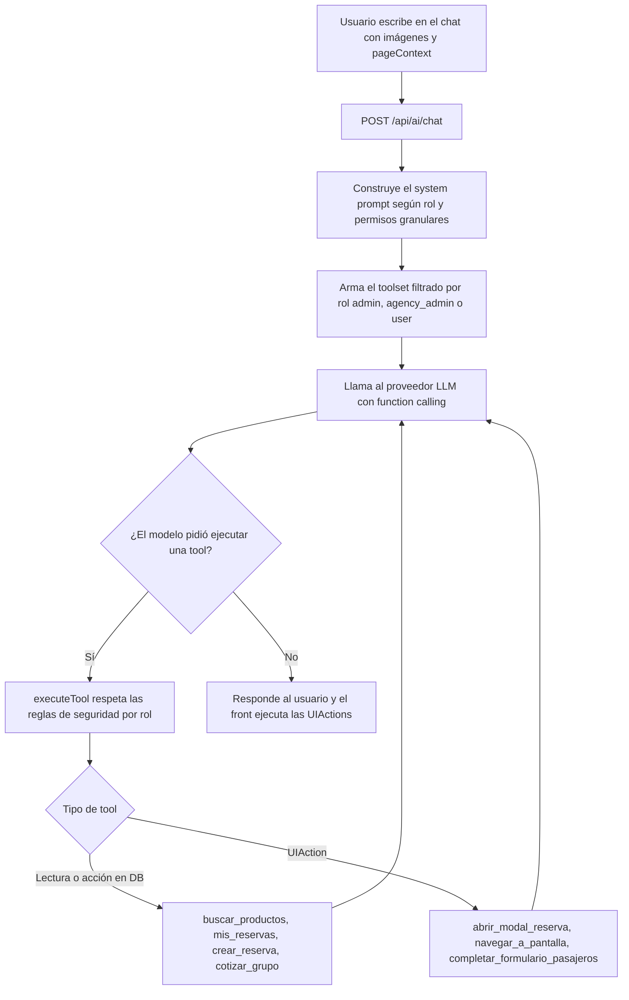

---

## 11. Expiración Automática de Reservas

Un cron de GitHub Actions (`.github/workflows/expire-reservations.yml`) golpea `GET /api/cron/expire-reservations` cada **3 minutos** — más seguido que el vencimiento de una reserva (`bloqueo_temporal`, 60 min por defecto) porque es lo bastante frecuente para el hold de stock de la sección 2 (`bloqueo_hold_minutos`, 10 min por defecto): con un intervalo más largo, un hold abandonado podría tardar casi el doble de su propio vencimiento en liberarse de verdad. No usa JWT: se protege con el header `X-Cron-Secret` comparado contra `CRON_SECRET`.

El handler hace tres pasadas: primero **libera los holds vencidos** (`expireOverdueHolds`) — reservas en `hold_temporal` con `BloqueoExpiraAt` ya vencido, les devuelve la disponibilidad al producto y **borra la fila** (no hay contacto cargado, así que no hay a quién notificarle); luego, sobre las reservas en `bloqueo_temporal`, **avisa** las que vencen en menos de 15 minutos y aún no tienen aviso (`expiration_warning_sent_at`), enviando notificación + email y marcando la bandera; por último **expira** las que ya pasaron su `bloqueo_expira_at`, devolviendo la disponibilidad al producto (resta `vendidos`), poniendo reserva y pasajeros en `expirada`, notificando a usuario y admin, enviando email y dejando un `SystemLog`. Responde con la cantidad de holds liberados, avisados y expirados.

- Backend: `cron_handler.go` (`ExpireReservations`, `expireOverdueHolds`), documentado en `backend-go/README.md`.

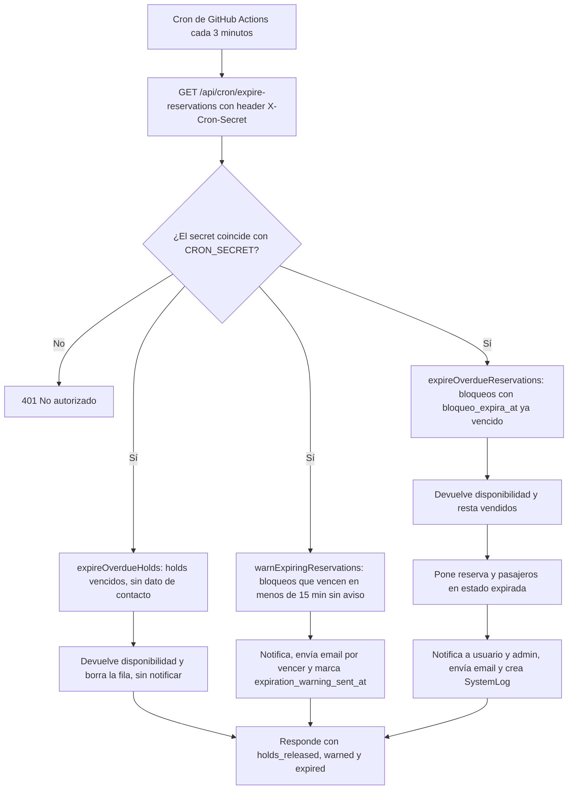

---

## 12. Reportes y Dashboard

El **Dashboard** y **Reportes** (gateados por `REPORTS_VIEW`) consumen métricas del backend. `GetStats` calcula totales del sistema (reservas, ventas de reservas confirmadas, usuarios activos de los últimos 30 días, pasajeros confirmados). Otros endpoints entregan ocupación, top de productos, alertas de riesgo y evoluciones. Los conceptos clave: **Rentabilidad** = `OP × vendidos` y **Riesgo** = `disponibles × neto_1`. La **exportación** entrega un CSV por tipo de entidad.

> Nota: el `backend-go/README.md` documenta los endpoints como `GET /api/analytics/stats` y `GET /api/reports/export`; en el ruteo actual (`main.go`) están implementados como `GET /api/reports/stats` (más los `/api/reports/*`) y la exportación como `GET /api/export/csv/:entityType` (permiso `REPORTS_EXPORT`).

- Backend: `report_handler.go` (`GetStats`, `GetRiskAlerts`, etc.), `analytics_handler.go`, `export_handler.go`.
- Frontend: `frontend/src/pages/Reportes.jsx`, `frontend/src/pages/Dashboard.jsx`.

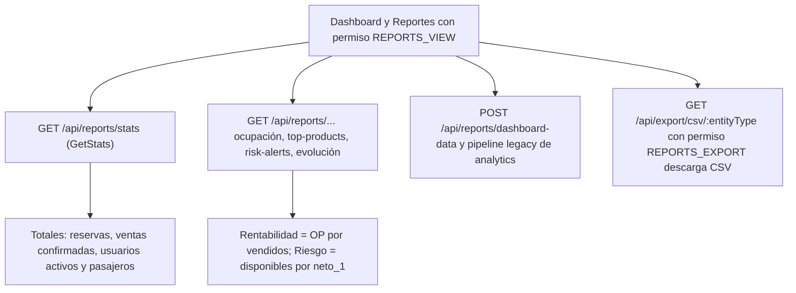

---

## 13. Notificaciones

Los eventos del sistema (nueva reserva, cesión recibida, grupo cotizado/aceptado/confirmado, expiración, etc.) generan `Notification` mediante los helpers `services.Notify*`. El `Sidebar` hace **polling** de `GET /api/notifications/unread-count` cada **20 segundos** y muestra el badge de no leídas.

La pantalla de **Notificaciones** lista los avisos (`GET /api/notifications`) y permite marcarlos como leídos (individual o todos), ocultarlos y —con `NOTIFICATIONS_CREATE`— crear notificaciones manuales.

- Backend: `notification_handler.go`, `services` de notificación.
- Frontend: `frontend/src/pages/Notificaciones.jsx`, polling en `frontend/src/components/ui/Sidebar.jsx`.

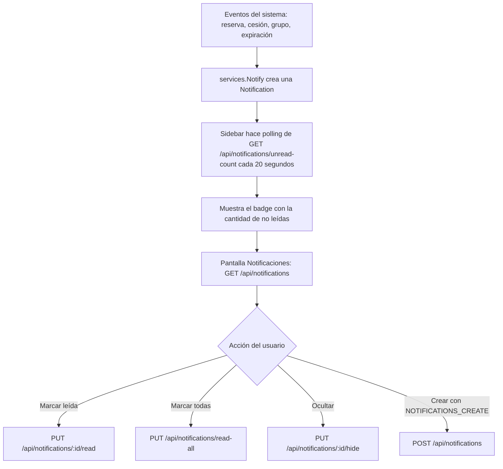

---

## 14. Configuraciones

La sección de configuración agrupa varios módulos, cada uno gateado por su permiso:

- **Ajustes generales**: pares clave-valor vía `GET/PUT /api/settings/:key` (ej. `bloqueo_minutos_default`, el vencimiento de una reserva en `bloqueo_temporal`, y `bloqueo_hold_minutos`, el vencimiento del hold de stock al elegir cantidad de pasajeros — ver sección 2). Permisos `SETTINGS_VIEW/UPDATE`.
- **Diseño / White-Label**: logo y colores de la agencia (`/api/white-label/config`), usados en la UI y en los itinerarios PDF. Permiso `WHITE_LABEL_*`.
- **Email**: configuración SMTP y plantillas por agencia (`/api/email-config/config`, `/templates`, `/test`, `/send-test`). Permiso `EMAIL_*`.
- **Plantillas de notificación** in-app (`/api/notification-config/templates` y preview). Permiso `NOTIFICATION_TEMPLATES_*`.
- **Config de IA**: alta/edición/prueba de proveedores LLM (`/api/ai/providers`). Permiso `AI_*`.

- Frontend: `frontend/src/pages/Settings.jsx`, `WhiteLabelConfig.jsx`, `EmailConfig.jsx`, `NotificationTemplates.jsx`, `AIConfig.jsx`.

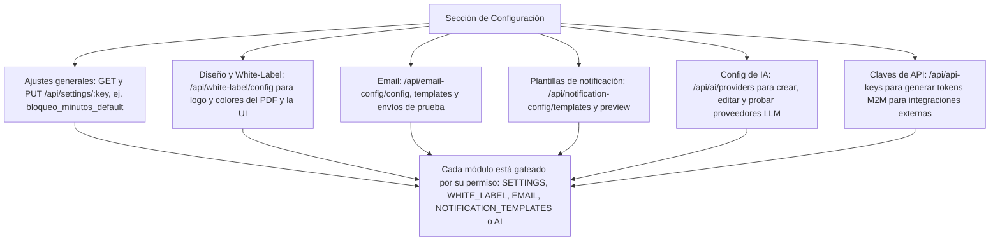

---

## 15. Claves de API para Integraciones Externas (M2M)

El sistema permite generar **API Keys de larga duración** para que sistemas externos (ERPs B2B, bots, automatizaciones) consuman la API sin sesión web. La clave secreta se genera criptográficamente y solo se muestra al momento de creación; la base de datos almacena únicamente su **hash SHA-256**.

El acceso está disponible para `admin` y `agency_admin` con reglas de ámbito diferentes:

- **`admin` (Super Admin):** Puede generar claves con alcance global o vinculadas a cualquier agencia. Ve y revoca cualquier clave del sistema.
- **`agency_admin`:** Puede generar claves, pero el backend **fuerza automáticamente** la vinculación a su propia agencia, sin importar el `agency_id` enviado. Solo ve y revoca las claves de su empresa.

La autenticación con API Key se realiza enviando la cabecera:

```http
X-API-Key: cupo_live_sk_...
```

- Backend: `GET / POST / DELETE /api/api-keys` (`handlers/api_key_handler.go`), `AuthMiddleware` con detección dual JWT / API Key (`middleware/auth.go`), modelo `APIKey` (`models/api_key.go`).
- Frontend: Panel de gestión en **Configuración ➔ Claves de API** (`components/system/ApiKeyPanel.jsx`).

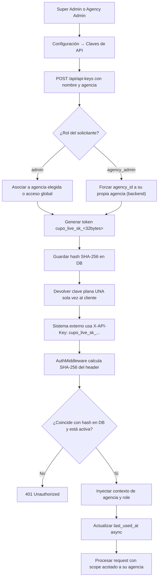

---

## 16. Estado del Sistema y Backups

El módulo de **Estado del Sistema** (`/logs`) ofrece monitoreo en tiempo real del estado de servicios (base de datos, conexiones, almacenamiento) y los logs detallados del sistema con posibilidad de filtrado y descarga en JSON.

El **sistema de backups** permite exportar el estado completo de la base de datos en formato JSON. Existen dos modos:

- **Backup Instantáneo Manual:** Generado desde la UI por un usuario con permiso `BACKUP_CREATE` (`POST /api/backup/generate`).
- **Backup Automático (Cron):** Invocado por un scheduler externo (`GET /api/cron/backup`) autenticado con `X-Cron-Secret`. Mantiene rotación de los últimos 30 backups.

Los backups son descargables como archivos JSON desde la UI (`GET /api/backup/download/:filename`).

- Backend: `handlers/backup_handler.go`, `GET /api/cron/backup`.
- Frontend: `components/system/BackupPanel.jsx`, `pages/LogsDelSitio.jsx`.

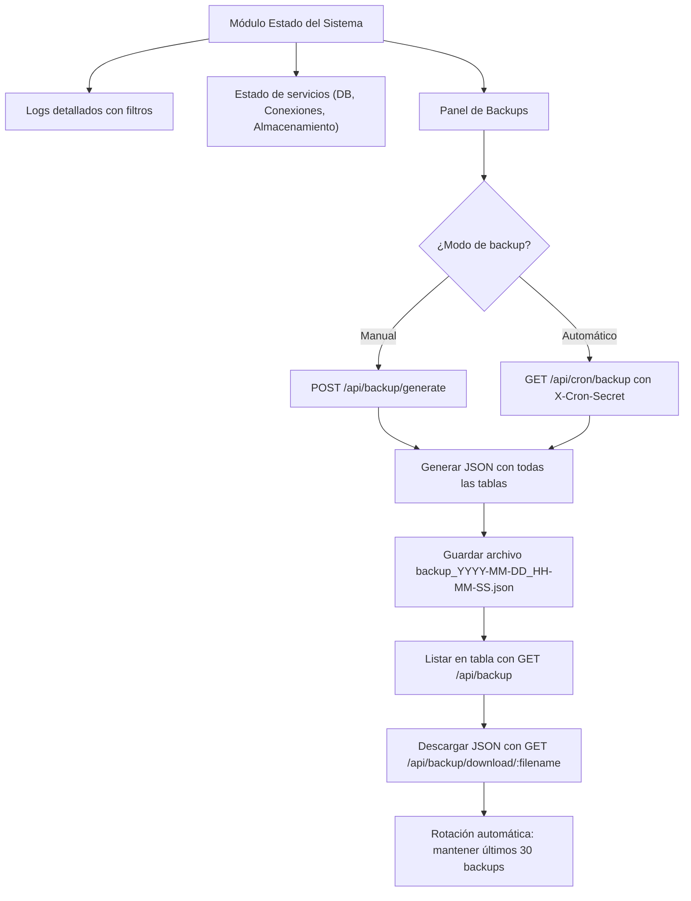

---

## 17. Integración con Netviax Atlas (Backoffice)

Integración con el backoffice externo Netviax Atlas: permite buscar un contacto/pasajero o una ficha de venta ya existente en Atlas y autocompletar el formulario de reserva. **Documentación completa y activamente mantenida en su propia carpeta**, separada de este documento por ser un desarrollo en curso con un proveedor externo: **[[Conexión y Estructura General|007 - Integración Netviax Atlas]]** (conexión/credenciales/URLs/manejo de errores, los 2 flujos de lectura ya construidos — contactos y fichas — y la fase de escritura pendiente: reportar tickets emitidos).

- Backend: `pkg/services/netviax_atlas_service.go`, `handlers/backoffice_handler.go`, `handlers/atlas_config_handler.go`.
- Frontend: `services/atlasService.js`, `services/atlasConfigService.js`, botón de búsqueda en `Availability.jsx`, página `AtlasConfig.jsx`.

---

## 18. Administración (módulo en construcción)

**Solo el andamiaje está construido — sin funcionalidad todavía.** Julian pidió crear la base de un módulo nuevo llamado "Administración", ubicado dentro del propio grupo "Administración" del Sidebar (no confundir el nombre del ítem de menú con el del grupo que lo contiene), para ir agregándole funciones incrementalmente en próximas conversaciones.

Lo que existe hoy (2026-08-12):

- Página `frontend/src/pages/Administracion.jsx`: shell con guard de permiso (`can('ADMINISTRACION_VIEW')`, después de todos los hooks, ver regla 5 de [[Gotchas y Reglas de Oro]]) y un placeholder ("Todavía no hay nada configurado acá").
- Ruta `/administracion` en `App.jsx`, mismo patrón `ProtectedRoute` + `Layout` que el resto de las páginas admin.
- Ítem "Administración" en `adminNavItems` (`Sidebar.jsx`), ícono `Settings`, gateado por el mismo permiso.
- Permiso `ADMINISTRACION_VIEW` sembrado en `seedRBAC()` (`db.go`, módulo `administracion`) y registrado en `frontend/src/lib/permissionModules.js` para que aparezca en la matriz de Roles.

**No hay endpoint de backend, tabla, ni acciones (CREATE/UPDATE/DELETE) todavía** — no se agregó nada a `main.go`/`index.go` porque no hay ningún dato que servir aún. Cuando se defina el contenido real del módulo, seguir el mismo patrón dual-entrypoint (regla 1 de [[Gotchas y Reglas de Oro]]) y sumar los permisos de acción que correspondan (`ADMINISTRACION_CREATE`/`_UPDATE`/`_DELETE`) junto a `ADMINISTRACION_VIEW`.

---

## 19. Oportunidades y Conversión a Producto

Una Oportunidad (`opportunities`, ver sección 7 para el modelo de Producto real) es la **pre-carga de un pedido comercial con una aerolínea**, antes de convertirse en inventario reservable. Tiene 2 estados independientes:

- **`Estado`** (negocio/agencia): `pendiente` → `aprobada` | `rechazada`. Solo admin aprueba/rechaza (`PUT /api/opportunities/:id/approve`, `OPPORTUNITIES_APPROVE`... aunque la ruta real hoy gatea con `OPPORTUNITIES_UPDATE`, ver nota de la sección 5 de [[Gotchas y Reglas de Oro]] sobre este permiso sembrado-pero-no-usado). No-admin solo edita/elimina mientras está en `pendiente`.
- **`EstadoInterno`** ("Estado Aerolínea", agregado 2026-08-12): `Cotizado` / `Rechazado por la aerolínea` / `Confirmado` / `Vencido` — seleccionable independiente del anterior; al elegir "Rechazado por la aerolínea" el frontend pide un `MotivoRechazo` (`Tarifa alta` / `Fechas incorrectas` / `Exceso de oferta` / `Vencido`) vía popup.

**Conversión a Producto (agregada 2026-08-13, flujo opcional)**: una oportunidad ya `aprobada` puede convertirse en un Producto real de una sola vez, vía `POST /api/opportunities/:id/convert-to-product` (`OPPORTUNITIES_CONVERT`, mismo criterio de permiso que editar: admin o creador+misma agencia). El frontend reusa `ProductForm.jsx` tal cual (el mismo formulario de alta de Gestión de Productos), precargado con lo que ya existe en la oportunidad (destino, compañía, agencia, temporada, fechas, cupo inicial = lugares liberados, tarifa ADT sugerida = Neto1) — quien convierte completa el resto (tarifas por tipo, ruta, ficha, etc.) igual que si estuviera cargando el producto a mano.

El producto resultante nace con **`PendienteAprobacion = true`**: no aparece en Disponibilidad (`GetProducts` sin `scope=management` exige `pendiente_aprobacion = false` además de `disponibilidad > 0` y `is_blocked_for_sale = false`) hasta que un admin lo aprueba (`PUT /api/products/:id/approve`, `PRODUCTS_APPROVE`). En Gestión de Productos, estos productos se muestran **apartados** en una sección propia (borde ámbar, arriba de la tabla principal) con su propio botón "Aprobar" — no entran a la tabla ni a sus filtros hasta que se aprueban. Este gate es enteramente independiente del flujo normal: un producto cargado directo desde Gestión de Productos nace en `false` y nunca lo atraviesa.

La oportunidad, al convertirse, pasa a **`Estado = "producto"`** (terminal, guardando `ProductoID` a modo informativo — no hay lectura automática de vuelta desde el Producto) — de ahí en más no se puede editar, eliminar, ni volver a aprobar/rechazar, ni siquiera como admin (`ya cumplió su ciclo`).

- Backend: `opportunities_handler.go` (`ConvertOpportunityToProduct`, guards de estado terminal en `UpdateOpportunity`/`DeleteOpportunity`/`ApproveOpportunity`), `product_handler.go` (`ApproveProduct`, filtro `pendiente_aprobacion` en `GetProducts`).
- Frontend: `GestionOportunidades.jsx` (botón "Convertir a producto", badge de estado, texto informativo "Producto #ID"), `GestionProductos.jsx` (sección "Pendientes de aprobación"), `hooks/useOpportunities.ts` (`useConvertOpportunityToProduct`), `hooks/useProducts.js` (`useApproveProduct`).

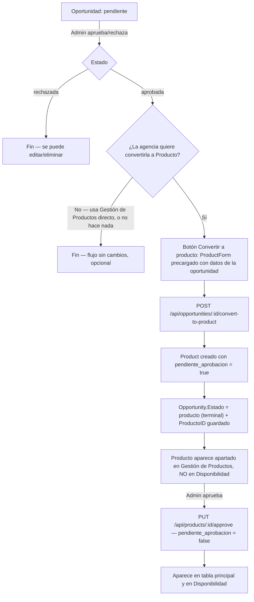

