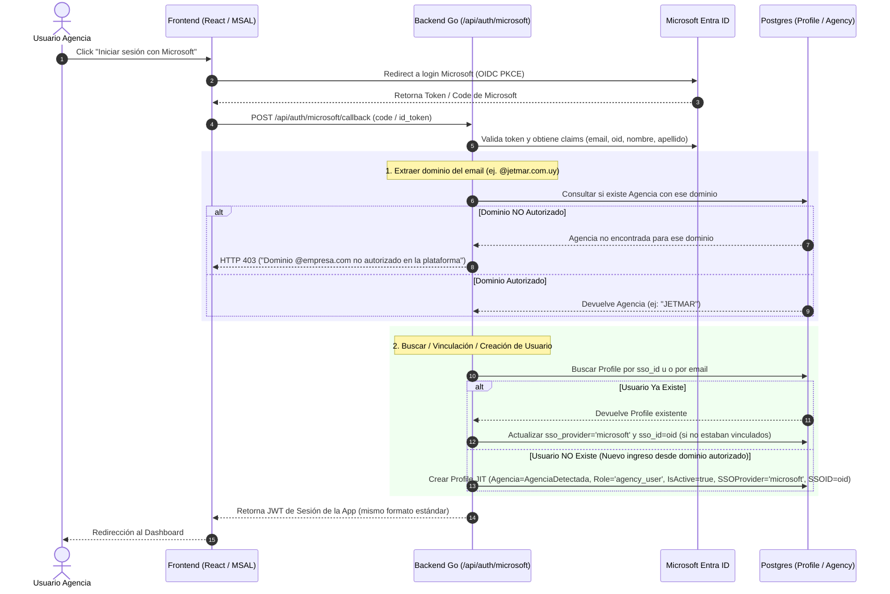

Guía de referencia para un **futuro posible** despliegue en Azure — Julian mencionó que "puede que se despliegue allí a futuro" (2026-08-13), sin fecha ni decisión firme. Esto es **documentación de planning, no un cambio de infraestructura en curso**: nada de lo que sigue se ejecutó, no hay recursos de Azure creados, y no se tocó ningún archivo de configuración de despliegue real (`vercel.json`, GitHub Actions). Antes de ejecutar cualquier paso de acá, re-verificar contra el estado real del repo — esto es un snapshot con fecha.

## 1. Dónde está parada la app hoy (para saber qué se está reemplazando)

- **Frontend**: Vite build estático (SPA, `BrowserRouter`, sin SSR) desplegado en Vercel como proyecto separado (`frontend/vercel.json`, solo hace rewrite de todas las rutas a `index.html`).
- **Backend**: Go + Gin + GORM, desplegado en Vercel como **función serverless** (`backend-go/vercel.json`, build con `@vercel/go` sobre `api/index.go`). Esto es la razón de ser de la regla de oro #1 del repo (dos entrypoints que duplican toda la tabla de rutas: `cmd/api/main.go` para local, `api/index.go` para el runtime serverless de Vercel) — un detalle importante para la sección 3.
- **Base de datos**: Postgres administrado por **Neon**, externo a Vercel — mismo Neon para desarrollo local y producción (no hay entorno de test/staging separado, ver regla de oro #3).
- **Cron**: el backend serverless no tiene ningún proceso en background propio. `GET /api/cron/expire-reservations` (vence holds/bloqueos temporales) se dispara vía **GitHub Actions** (`.github/workflows/expire-reservations.yml`, cada 3 minutos) y `check-deadlines.yml` (avisos de vencimiento) — ambos le pegan al endpoint con un secreto compartido (`CRON_SECRET`) via `curl`.
- **Variables de entorno actuales** (`os.Getenv` en `backend-go/`): `DATABASE_URL`, `JWT_SECRET`, `CRON_SECRET`, `PORT`, `URL_FRONTEND`, `EMAIL_FROM`, `SMTP_HOST`/`SMTP_PORT`/`SMTP_USER`/`SMTP_PASS`, `ANTHROPIC_API_KEY`/`OPENAI_API_KEY`/`GEMINI_API_KEY`, `ATLAS_API_URL_PROD`/`ATLAS_API_URL_TEST`. Todo esto necesita un hogar nuevo en Azure (sección 4).

## 2. Mapeo de servicios: Vercel/Neon → Azure

| Pieza actual | Equivalente recomendado en Azure | Alternativa | Por qué |
|---|---|---|---|
| Frontend (Vercel, build estático) | **Azure Static Web Apps** | Azure Storage Static Website + Azure CDN/Front Door | Es el análogo más directo a lo que ya tenés en Vercel: build automático desde GitHub, dominio custom, TLS gratis, y soporta un backend de API vinculado si algún día se necesita (hoy no aplica, el backend va aparte). |
| Backend (Vercel, función serverless Go) | **Azure Container Apps** (contenedor con el Gin app corriendo como servidor normal, no como función) | Azure App Service (Linux, contenedor) | Go no es un runtime de primera clase en Azure Functions (soporte vía "custom handler", inmaduro comparado con el soporte nativo de Vercel) — Container Apps es el patrón estándar para un binario Go de vida larga en Azure, con autoscaling, y **elimina completamente la necesidad de `api/index.go`**: un solo entrypoint (`cmd/api/main.go`) sirve tanto local como producción, así que la regla de oro #1 ("dos entrypoints duplican toda la tabla de rutas") deja de aplicar. Beneficio real, no solo cosmético — borra una clase entera de bug de este repo. |
| Base de datos (Neon Postgres) | **Mantener Neon** (funciona igual desde cualquier host, es solo un endpoint Postgres público) | Azure Database for PostgreSQL Flexible Server | No hay urgencia de migrar la DB — Neon seguiría funcionando exactamente igual apuntado desde Azure. Solo migrar si se busca latencia más baja (mismo datacenter que el backend) o consolidar facturación/monitoreo en un solo proveedor. Si se migra: es una migración de datos real (`pg_dump`/`pg_restore` o servicio de migración de Azure), no un simple cambio de connection string — planificar una ventana de mantenimiento. |
| Secretos (hoy: variables de entorno de Vercel) | **Azure Key Vault** + Managed Identity | Variables de entorno de Container Apps (más simple, menos seguro) | Ver nota de seguridad abajo — esta migración es la oportunidad natural de cerrar el hallazgo de la auditoría de seguridad sobre el secreto JWT de fallback hardcodeado (ver [[Auditoría de Seguridad y QA - 2026-08-13]], sección Seguridad Backend). Con Key Vault + Managed Identity, el backend nunca tiene el secreto en una variable de entorno plana — lo pide en runtime con una identidad de Azure, sin credenciales embebidas en ningún lado. |
| Cron (GitHub Actions → `curl` al endpoint) | **Mantener GitHub Actions** (funciona igual sea cual sea el host) | Azure Container Apps Jobs (KEDA cron scaler) o Azure Logic Apps | GitHub Actions no depende de dónde esté desplegado el backend — no hace falta cambiar nada acá salvo actualizar el secret `BACKEND_URL` a la nueva URL de Azure. Migrar a un scheduler nativo de Azure es una mejora de "todo en un solo lugar", no una necesidad. |
| CI/CD (Vercel auto-deploy en push) | **GitHub Actions** con la action oficial de Azure (`azure/container-apps-deploy-action` para el backend, Azure Static Web Apps ya genera su propio workflow al crear el recurso) | Azure DevOps Pipelines | Se mantiene el mismo flujo "push a main → deploy automático", solo cambia el target del deploy. |
| Dominio + TLS | Dominio custom + certificado gestionado directo en Static Web Apps / Container Apps | Azure Front Door (si se necesita WAF, CDN global, o un solo dominio na de frente a ambos servicios) | Front Door es útil si más adelante se quiere un único dominio público (`app.tuempresa.com`) enrutando a frontend y backend por path, con reglas de WAF — no es necesario para un lift-and-shift simple. |
| Monitoreo | Azure Application Insights | — | Complementa (no reemplaza) el `SystemLog`/`SystemSetting` que ya existe en la app — Application Insights da métricas de infraestructura (latencia, errores HTTP, cold starts) que hoy no se ven en ningún lado. |

## 3. Paso a paso (lift-and-shift mínimo, sin tocar arquitectura de tenancy)

Esto asume la ruta más simple: mover el hosting, sin re-arquitecturar multi-tenancy (ver sección 4 para esa decisión aparte). Orden sugerido — cada paso es reversible/aislado del anterior, se puede parar en cualquier punto sin dejar nada roto:

1. **Containerizar el backend**: escribir un `Dockerfile` simple para `backend-go/` que compile y corra `cmd/api/main.go` (multi-stage build: `golang:1.2x-alpine` para compilar, imagen final `alpine` o `distroless` liviana). Probar el contenedor localmente (`docker build` + `docker run`) apuntando al MISMO Neon de siempre, antes de tocar nada de Azure — valida que el binario corre igual en contenedor que con `go run`.
2. **Crear los recursos base en Azure**: Resource Group, Azure Container Registry (ACR, para guardar la imagen del backend), Container Apps Environment, Key Vault. Todo esto se puede armar con el portal de Azure o con `az` CLI/Bicep/Terraform — al ejecutar esto de verdad, decidir la herramienta según lo que el equipo ya use (si no hay preferencia, `az` CLI a mano para el primer intento, Bicep/Terraform una vez que el setup esté estable y se quiera repetible).
3. **Cargar los secretos actuales en Key Vault**: los mismos de la lista de la sección 1 (`DATABASE_URL` de Neon, `JWT_SECRET`, `CRON_SECRET`, credenciales SMTP, API keys de IA, URLs de Atlas). Dar al Container App una Managed Identity con permiso de lectura sobre esos secretos puntuales (no acceso total al Key Vault).
4. **Publicar la imagen a ACR y desplegar el Container App**, con la Managed Identity + referencias a los secretos de Key Vault en vez de variables de entorno planas. Verificar que levanta y responde en un endpoint de salud simple antes de apuntarle tráfico real.
5. **Actualizar `URL_FRONTEND`** (env var que el backend usa, probablemente para construir links en emails/notificaciones) a la URL nueva del frontend en Azure Static Web Apps, una vez creado.
6. **Crear el Static Web App** para el frontend, apuntado al mismo repo/rama, con el build command de Vite (`npm run build`, output `dist/`). Actualizar `VITE_API_URL` (o el nombre real de la env var de build del frontend — confirmar en `frontend/vite.config.js`/`.env.example` antes de asumir) a la URL del nuevo backend en Container Apps.
7. **Actualizar el secret `BACKEND_URL`** en GitHub Actions (usado por `expire-reservations.yml`/`check-deadlines.yml`) a la nueva URL — sin este paso, los cupos en `bloqueo_temporal` dejan de vencer solos (ver regla de oro #4 del repo).
8. **Correr en paralelo unos días** (Vercel + Azure ambos apuntando al mismo Neon) antes de cortar DNS/deprecar Vercel — dado que no hay entorno de test/staging, esta es la única red de seguridad real: si algo falla en Azure, Vercel sigue sirviendo tráfico real sin downtime.
9. **Cortar tráfico** (DNS/dominio custom apuntando a Azure) solo después de confirmar que el paralelo corrió sin sorpresas. Recién ahí dar de baja los proyectos de Vercel.
10. **Borrar `api/index.go`** del repo — ya no hace ninguna falta si el backend corre como Container App (servidor de vida larga, no función serverless). Esto también borra la regla de oro #1 completa del repo — actualizar `CLAUDE.md`/`Gotchas y Reglas de Oro.md` para reflejarlo cuando se llegue a este punto (un solo entrypoint, ya no dos).

## 4. Multi-tenant: qué significa acá y qué opciones hay

"Tenant" es un término sobrecargado — vale la pena separar dos ejes distintos antes de decidir algo, porque son cambios de arquitectura completamente diferentes:

### Eje 1: aislamiento de DATOS entre agencias (ya existe, informalmente)

Hoy cada agencia es, de hecho, un tenant: todo dato de negocio (`Product`, `Reservation`, `Opportunity`, etc.) tiene un campo `Agencia`/`AgencyID`, y el código de cada handler es responsable de filtrar por esa agencia para roles no-admin — un modelo de "tenencia a nivel de aplicación" sobre una única base de datos compartida. **La auditoría de seguridad del 2026-08-13 encontró varios casos donde ese filtro faltaba** (reportes, transfers, templates — ver [[Auditoría de Seguridad y QA - 2026-08-13]]), es decir: el aislamiento de datos existe, pero depende 100% de que cada handler nuevo recuerde aplicarlo (regla 14 de [[Gotchas y Reglas de Oro]]).

Si se quiere un aislamiento más fuerte (que no dependa de que un desarrollador se acuerde de un `WHERE agencia = ?` en cada handler nuevo), las opciones, de menor a mayor esfuerzo:

- **Row-Level Security (RLS) de Postgres**: políticas a nivel de base de datos que filtran filas automáticamente según la agencia de la sesión — aunque un handler se olvide del filtro, la DB no devuelve filas de otra agencia. Funciona igual en Neon o en Azure Database for PostgreSQL (ambos son Postgres estándar). Es la opción de mejor relación esfuerzo/beneficio: no requiere N bases de datos ni N schemas, solo políticas SQL + que la conexión de cada request sepa "soy la agencia X" (vía `SET app.current_agency` o similar al abrir la transacción).
- **Schema-per-tenant** (un schema Postgres por agencia, mismo servidor): aislamiento más fuerte, pero migraciones y queries cross-tenant (reportes globales de admin) se vuelven más complejas — cada migración corre N veces.
- **Base de datos separada por agencia**: el aislamiento más fuerte posible, pero el mayor costo operativo (N conexiones, N backups, N migraciones) — normalmente solo se justifica por requisitos de compliance/contrato explícitos de un cliente grande, no como default.

**Recomendación si se retoma esto en serio**: RLS es el punto medio razonable, y es independiente de la migración a Azure — se puede adoptar hoy mismo en Neon sin esperar a mudarse. Vale la pena evaluarlo como respuesta directa a los hallazgos de la auditoría de seguridad, no solo como preparación para Azure.

### Eje 2: Autenticación Corporativa y Login con Microsoft (SSO con Entra ID)

Dado que las agencias clientes utilizan el ecosistema de **Microsoft 365 / Azure AD (Entra ID)**, la integración de **Login con Microsoft** permite ofrecer SSO corporativo (un-click login), eliminando la gestión de contraseñas locales y centralizando las bajas de usuarios.

#### 1. Convivencia con la Autenticación Actual
- **Transparente y Retrocompatible**: El Login con Microsoft **convive** con el sistema actual de email/contraseña (bcrypt).
- **Emisión del Mismo JWT Interno**: Sin importar si el usuario ingresó por contraseña o por Microsoft, una vez validada la identidad, el backend emite exactamente el **mismo token JWT de sesión** (con `id`, `role`, `agencia`, `admin`).
- **Impacto Cero en RBAC**: Los middlewares (`RequirePermission`, `can()`) y el filtrado por agencia en los handlers siguen funcionando exactamente igual sin enterarse de cómo se autenticó el usuario.

#### 2. Modelo de Datos e Identificador Vinculante (`Profile`)

Para vincular las identidades de Microsoft (o Google en el futuro) con la tabla `profiles` (`models.go`), se agregan campos explícitos de binding:

```go
type Profile struct {
    ID                uuid.UUID `gorm:"type:uuid;primaryKey" json:"id"`
    Email             string    `gorm:"unique;not null" json:"email"`
    Password          string    `gorm:"-" json:"password,omitempty"`
    EncryptedPassword string    `gorm:"column:encrypted_password" json:"-"` // Nullable para usuarios 100% SSO
    Nombre            string    `json:"nombre"`
    Apellido          string    `json:"apellido"`
    Agencia           string    `json:"agencia"`
    Role              string    `gorm:"default:'agency_user'" json:"role"`
    IsActive          bool      `gorm:"default:true" json:"activo"`

    // Identificador vinculante SSO (Microsoft / Google)
    SSOProvider       *string   `gorm:"column:sso_provider" json:"sso_provider,omitempty"` // "microsoft", "google"
    SSOID             *string   `gorm:"column:sso_id;index" json:"sso_id,omitempty"`       // Azure AD 'oid' o OIDC 'sub'
}
```

Además, en la tabla de agencias (`Agencies` / configuración) se explicita el **Dominio Corporativo** asignado:
- `Agency.Dominio` (ej. `"jetmar.com.uy"`, `"tiendavictoria.com.uy"`, `"buemes.com.uy"`).

#### 3. Restricción Estricta por Dominios y Auto-aprovisionamiento JIT (Just-In-Time)

> [!IMPORTANT]
> **Regla de Seguridad No Negociable**: Un usuario de Microsoft que NO pertenezca a un dominio de agencia autorizado **NO puede auto-crearse una cuenta ni acceder al sistema**.

El flujo de inicio de sesión con Microsoft valida estrictamente el dominio del correo antes de permitir el ingreso o la creación de un perfil:



#### 4. Pasos para Configurar Microsoft Entra ID en Azure
1. **App Registration Multi-Tenant**: En Azure Portal, crear un App Registration configurado como *"Accounts in any organizational directory (Any Microsoft Entra ID directory - Multitenant)"*.
2. **Redirect URIs**: Configurar la URL de retorno del frontend/backend (ej: `https://app.tuempresa.com/auth/callback` o `https://api.tuempresa.com/api/auth/microsoft/callback`).
3. **API Permissions**: Solicitar scopes estándar `openid`, `profile`, `email`, `User.Read`.
4. **Variables de Entorno Backend**:
   - `AZURE_CLIENT_ID`: ID de aplicación de Azure.
   - `AZURE_CLIENT_SECRET`: Guardado de forma segura en **Azure Key Vault**.
   - `AZURE_TENANT_ID`: `common` (para permitir que cualquier agencia inicie sesión con sus credenciales de Microsoft 365).

---

## 5. Qué NO cambiaría con esta migración

- El modelo de datos (`models.go`), la lógica de negocio, RBAC granular, y el 99% del código Go/React — todo esto es agnóstico de dónde corre.
- Neon como base de datos (a menos que se decida migrar explícitamente, ver sección 2).
- El flujo de cron vía GitHub Actions (solo cambia la URL de destino).

## 6. Antes de ejecutar cualquiera de estos pasos de verdad

- Confirmar con Julian el motivo real de la migración (¿costo? ¿requisito de un cliente/compliance? ¿preferencia de infraestructura del equipo?) — cambia qué tan a fondo vale la pena ir en la sección 4.
- Presupuestar el costo real de Azure Container Apps + Static Web Apps + Key Vault para el volumen de tráfico actual, comparado contra el plan de Vercel actual — puede que no sea una mejora de costos, dependiendo del tier.
- Re-verificar esta guía contra el estado real del repo antes de actuar (es un snapshot fechado 2026-08-13) — en particular, confirmar el nombre exacto de la env var del frontend para la URL del backend (`VITE_API_URL` es la asumida en `CLAUDE.md`, pero confirmar en `vite.config.js` antes de usarla en un paso real).
