# Flujos de Funcionalidades

Este documento describe cada funcionalidad del **Sistema de Gestión de Cupos** junto con su diagrama de flujo. Cada sección incluye una breve descripción textual y un diagrama que refleja la lógica real implementada en el repositorio (validaciones, estados y endpoints).

## Índice

1. [Autenticación y Login con JWT y RBAC](#1-autenticación-y-login-con-jwt-y-rbac)
2. [Disponibilidad y Creación de Reserva](#2-disponibilidad-y-creación-de-reserva)
3. [Ciclo de Vida de la Reserva](#3-ciclo-de-vida-de-la-reserva)
4. [Solicitudes y Confirmaciones](#4-solicitudes-y-confirmaciones)
5. [Cesión de Cupos entre Agencias](#5-cesión-de-cupos-entre-agencias)
6. [Grupos y Vuelos a Medida](#6-grupos-y-vuelos-a-medida)
7. [Gestión de Productos](#7-gestión-de-productos)
8. [Gestión de Nóminas](#8-gestión-de-nóminas)
9. [RBAC Usuarios Roles y Permisos](#9-rbac-usuarios-roles-y-permisos)
10. [Asistente IA](#10-asistente-ia)
11. [Expiración Automática de Reservas](#11-expiración-automática-de-reservas)
12. [Reportes y Dashboard](#12-reportes-y-dashboard)
13. [Notificaciones](#13-notificaciones)
14. [Configuraciones](#14-configuraciones)

---

## 1. Autenticación y Login con JWT y RBAC

El login valida las credenciales contra `Profile` (comparando el hash `bcrypt`), verifica que la cuenta esté activa y, si todo es correcto, firma un **JWT HS256** de 24 horas con los claims `id`, `email`, `agencia`, `role` y `admin`. En cada request protegida el `AuthMiddleware` valida el token y adjunta esos datos al contexto; `RequirePermission` gatea los endpoints sensibles.

La resolución de permisos **RBAC** ocurre una sola vez después del login: el frontend llama a `GET /users/me/permissions` para saber qué mostrar/habilitar. Un `admin` recibe **todos** los códigos activos (bypass total), mientras que el resto los obtiene navegando `user_roles → role_permissions → permissions`. El `Sidebar` filtra sus ítems de menú según esos códigos.

- Backend: `POST /api/auth/login` (`user_handler.go`), `GET /users/me/permissions` (`rbac_handler.go`), middleware `AuthMiddleware` / `RequirePermission` (`middleware/auth.go`).
- Frontend: `frontend/src/components/ui/Sidebar.jsx`.

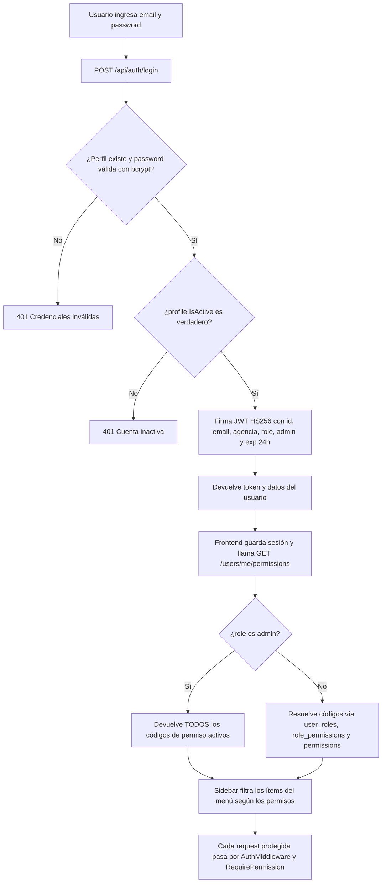

---

## 2. Disponibilidad y Creación de Reserva

La pantalla de **Disponibilidad** es el catálogo de vuelos reservables. El backend solo muestra productos con `disponibilidad > 0`, no bloqueados para venta y accesibles para la agencia (propios, cedidos vía `RestrictedAgency` o compartidos vía `ProductSharedAgency`). Desde ahí la agencia carga un formulario con uno o más pasajeros y confirma.

`CreateReservation` valida acceso al cupo, verifica disponibilidad suficiente para la cantidad de pasajeros, descuenta `disponibilidad` y suma `vendidos`, y calcula la expiración del bloqueo (`bloqueo_temporal_minutos` del producto o el setting `bloqueo_minutos_default`, 60 por defecto). Si se cargó `doc_contable` la reserva nace **confirmada**; si no, en **bloqueo_temporal**. Cada pasajero se crea como su propio ticket individual (1 lugar, 1 fila en `passengers`) y se calcula su `NRO`. Finalmente notifica al admin, avisa si la disponibilidad quedó baja y envía email a la agencia.

- Backend: `POST /api/orders/` → `CreateReservation` (`order_handler.go`), `GET /api/products/` → `GetProducts` (`product_handler.go`).
- Frontend: `frontend/src/pages/Availability.jsx`; sección `DisponibilidadSection` en `Documentacion.jsx`.

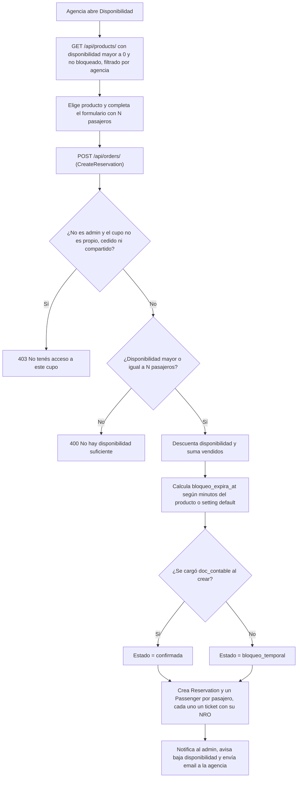

---

## 3. Ciclo de Vida de la Reserva

Una reserva se mueve por una máquina de estados. Los valores canónicos definidos en el backend (`models.go`) son: `bloqueo_temporal`, `confirmada`, `solicitud_cancelacion`, `cancelada`, `expirada` y `cedido`. La documentación de usuario (`ReservasSection` en `Documentacion.jsx`) además presenta visualmente el estado **`procesando`** (el operador tomó la solicitud y está emitiendo el ticket) y el badge **`cedido`** (cupo prestado por otra agencia).

Transiciones reales:
- **bloqueo_temporal → confirmada**: al cargar el documento contable (`AddDocContable`) o al confirmar (`ConfirmReservation`).
- **bloqueo_temporal → expirada**: el cron libera el cupo cuando vence `bloqueo_expira_at` (ver sección 11).
- **cualquiera → solicitud_cancelacion**: `RequestCancellation` guarda el estado previo en `pre_cancel_estado`.
- **solicitud_cancelacion → cancelada**: `ResolveCancellation` aprueba, libera el cupo y conserva la fila en el historial.
- **solicitud_cancelacion → estado previo**: `ResolveCancellation` rechaza y restaura `pre_cancel_estado`.

- Backend: `order_handler.go` (`AddDocContable`, `ConfirmReservation`, `RequestCancellation`, `ResolveCancellation`), `cron_handler.go`. Referencia de datos: `ESTRUCTURA_BD_GO.md`.

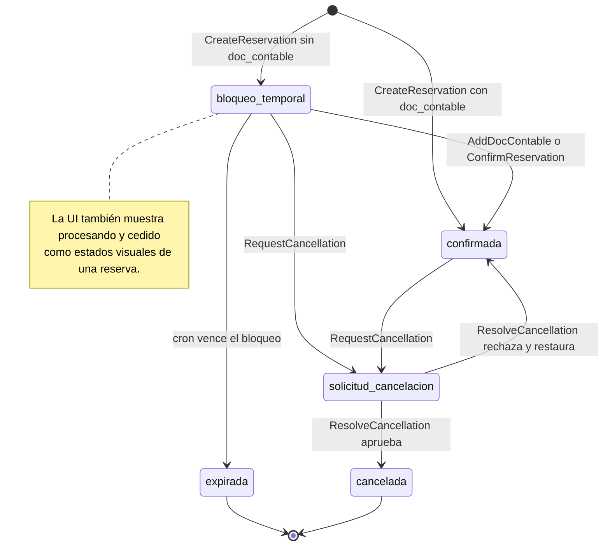

---

## 4. Solicitudes y Confirmaciones

Ambas vistas de agencia consumen el mismo endpoint `GET /api/orders/` (`GetAllReservations`, que ya filtra por rol/agencia) y separan las filas del lado del cliente en `reservationService.js`: **Solicitudes** excluye las reservas `confirmada` y `cedido`; **Confirmaciones** muestra solo las `confirmada`/`confirmado`.

En **Solicitudes** la agencia puede cargar el documento contable (que confirma la reserva), solicitar la cancelación, y ve una cuenta regresiva mientras la reserva está en `bloqueo_temporal`. En **Confirmaciones** puede solicitar la cancelación y generar el **Itinerario PDF** (con la marca white-label de su agencia), obteniendo el detalle completo de pasajeros vía `GET /api/orders/:id`.

- Frontend: `frontend/src/pages/Requests.jsx`, `frontend/src/pages/Confirmations.jsx`, `frontend/src/services/reservationService.js`.

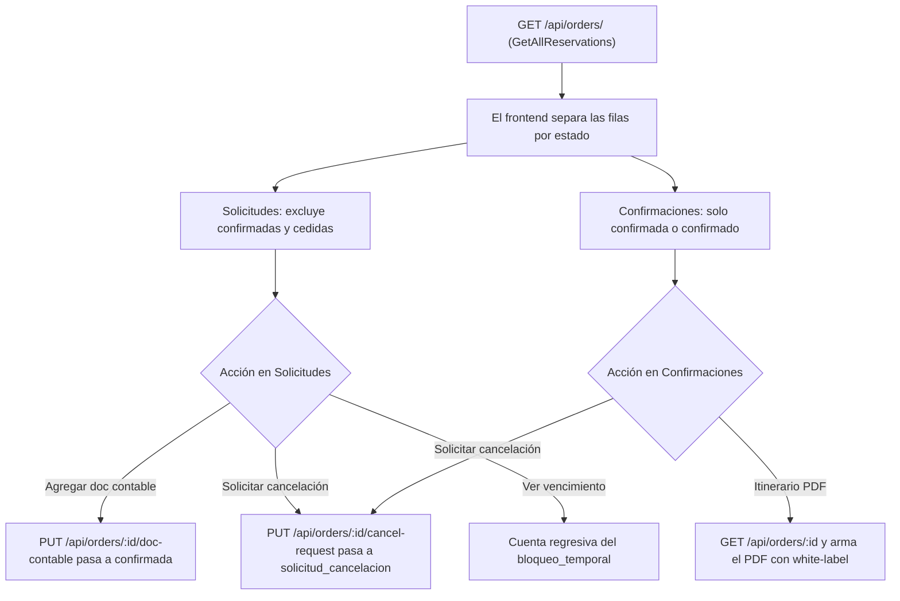

---

## 5. Cesión de Cupos entre Agencias

El operador (owner) o un admin puede **ceder (prestar) cupos** de un producto a otra agencia. `CreateTransfer` determina la agencia cedente (la dueña `Agencia`, o la `RestrictedAgency` si el producto ya es un espejo de una cesión previa), valida que origen y destino difieran y que haya disponibilidad suficiente. Luego, en una transacción: descuenta el stock del producto origen, crea un **producto espejo** restringido a la agencia destino (`RestrictedAgency`, `SourceAgency`, `TransferID`) y registra un `AvailabilityTransfer`. La agencia receptora reserva sobre ese espejo con normalidad.

Ceder o recuperar **no** genera reservas de auditoría: la trazabilidad queda en `AvailabilityTransfer`. `ReclaimTransfer` devuelve el stock disponible del espejo al producto original (total o parcial); los cupos ya reservados no se pueden recuperar.

- Backend: `POST /api/transfers` y `POST /api/transfers/:id/reclaim` (`transfer_handler.go`).
- Frontend: `CesionSection` en `Documentacion.jsx`, `components/TransferModal.jsx`.

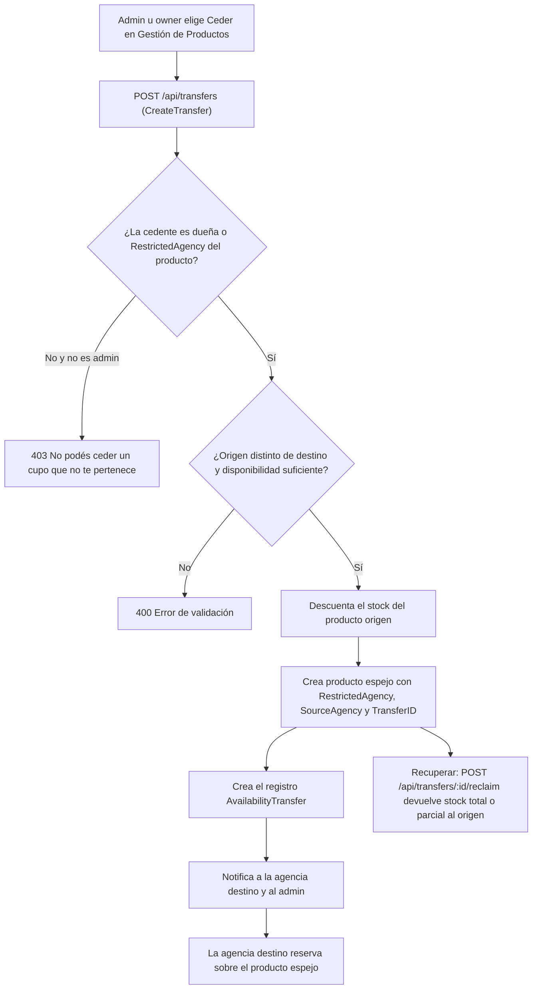

---

## 6. Grupos y Vuelos a Medida

Un **grupo** es un vuelo a medida que la agencia propone y el admin cotiza. Tiene una máquina de estados de **2 fases** (`models.go`):

- **Fase 1 — `EstadoCotizacion`**: `pendiente → cotizada → aceptada | rechazada`.
- **Fase 2 — `EstadoReservar`** (solo tras aceptar): `confirmada → cancelacion_solicitada → cancelada` (o vuelve a `confirmada` si se rechaza la cancelación).

La agencia crea la solicitud con una o más opciones de itinerario (`RequestGroup`, cada opción comparte `solicitud_id`). El admin completa la cotización y la envía explícitamente (`SendGroupQuote`, que exige condiciones, neto y vencimiento de cotización). La agencia acepta una opción (`AcceptGroupQuote`, no puede estar vencida; sus hermanas quedan `rechazada`). El admin confirma (`ConfirmGroup`, recién ahí se revelan nominación/emisión/gastos). La cancelación de un grupo confirmado se solicita y se resuelve (`RequestGroupCancellation` / `ResolveGroupCancellation`).

- Backend: `group_handler.go`, `models.go`.
- Frontend: `frontend/src/pages/GestionGrupos.jsx` (admin), `frontend/src/pages/Requests.jsx` (agencia).

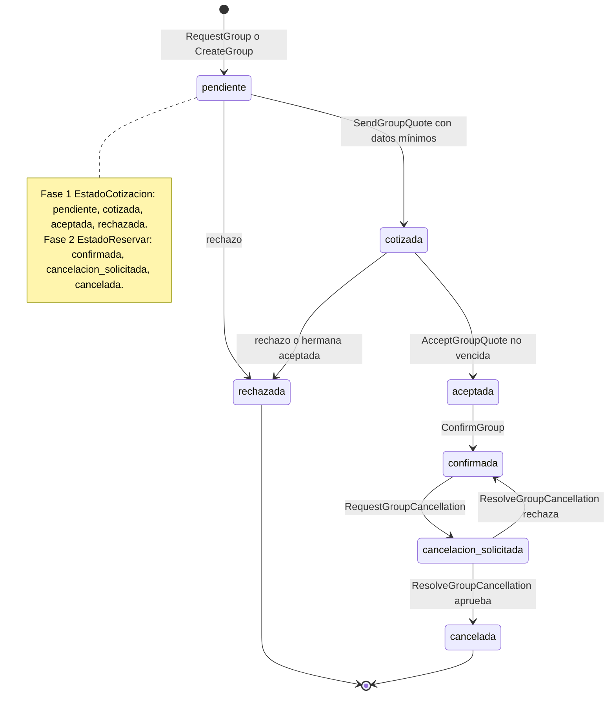

---

## 7. Gestión de Productos

Pantalla de administración del inventario (**cupos**/bloqueos aéreos). Permite el CRUD de productos (gateado por `PRODUCTS_CREATE/UPDATE/DELETE`), la **importación masiva desde Excel** (descarga de plantilla XLSX, carga y `POST /api/products/bulk` que procesa fila por fila reportando errores) y el **bloqueo de venta** (`is_blocked_for_sale`), que oculta el producto de Disponibilidad sin afectar reservas existentes.

El borrado se bloquea si el producto tiene reservas o cesiones asociadas. Desde acá también se accede a ceder/compartir cupos (ver sección 5).

- Backend: `product_handler.go` (`GetProducts`, `CreateProduct`, `UpdateProduct`, `DeleteProduct`, `BulkCreateProducts`).
- Frontend: `frontend/src/pages/GestionProductos.jsx`, `ProductosSection` en `Documentacion.jsx`, `components/ProductBulkUpload.jsx`.

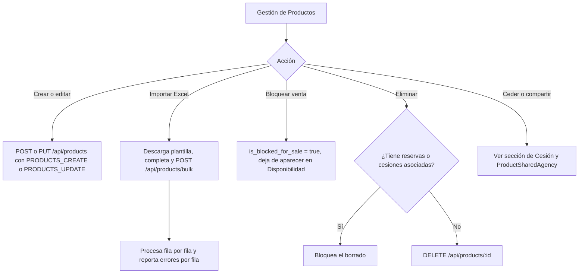

---

## 8. Gestión de Nóminas

La nómina es el **roster de pasajeros** por producto. Consume `GET /api/orders/` (con `Passengers` y `roster_product_id`) y agrupa cada pasajero por `roster_product_id`: si la venta se hizo sobre un producto-espejo cedido, la nómina real es la del producto **dueño** (la agencia que gestiona el vuelo), evitando fragmentar el roster.

Cada pasajero es un ticket individual: se le puede **asignar número de ticket** y precio de venta (`PUT /api/orders/:id/passengers/:passengerId`), editar todos sus datos (`.../full`), generar el **itinerario PDF** con marca white-label (requiere ticket asignado) y exportar el roster a XLSX.

- Backend: `order_handler.go` (`GetAllReservations`, `UpdatePassengerTicket`, `UpdatePassenger`).
- Frontend: `frontend/src/pages/GestionNominas.jsx`.

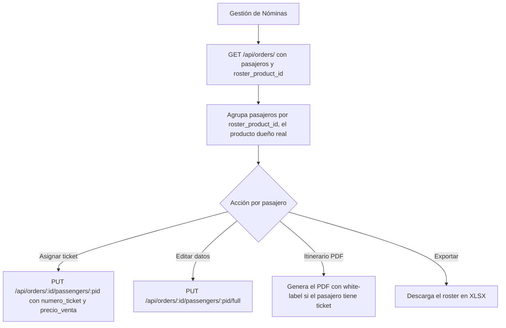

---

## 9. RBAC Usuarios Roles y Permisos

El control de acceso es granular y basado en códigos `MODULE_ACTION` (ej. `PRODUCTS_CREATE`, `RESERVATIONS_DELETE`). Los **permisos** son el catálogo de códigos; los **roles** agrupan permisos (`role_permissions`); los **usuarios** reciben un rol (`user_roles`). La gestión de cada entidad está gateada por sus propios permisos (`USERS_*`, `ROLES_*`, `PERMISSIONS_*`).

En tiempo de request, el middleware `RequirePermission(code)` deja pasar siempre al `admin` (bypass total) y, para el resto, verifica que exista el `code` activo recorriendo `user_roles → role_permissions → permissions`; si no, responde `403`.

- Backend: `middleware/auth.go` (`RequirePermission`), `rbac_handler.go`, `user_handler.go`, `services/rbac_service.go`.
- Frontend: `frontend/src/pages/GestionUsuarios.jsx`, `GestionRoles.jsx`, `GestionPermisos.jsx`.

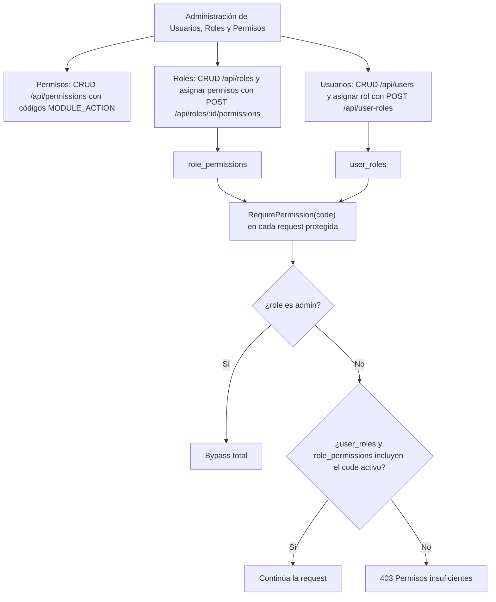

---

## 10. Asistente IA

El asistente (`POST /api/ai/chat`) arma un **system prompt** dinámico según el rol y los permisos granulares del usuario, con reglas de seguridad críticas: un usuario `user`/`agency_user` solo ve sus propias reservas y nunca datos financieros (neto, OP, rentabilidad) ni de otras agencias; `agency_admin` solo su agencia; `admin` todo. También recibe el **contexto de pantalla** (`pageContext`) para resolver referencias posicionales.

El backend expone un **toolset filtrado por rol** (con function calling sobre OpenAI/Anthropic/Google). Las herramientas son de lectura/acción sobre la DB (`buscar_productos`, `mis_reservas`, `crear_reserva`, `cotizar_grupo`, `rentabilidad`, etc.) o **UIActions** que instruyen al frontend (`abrir_modal_reserva`, `navegar_a_pantalla`, `completar_formulario_pasajeros`). El bucle llama al modelo, ejecuta las tools que pida respetando las reglas de seguridad, y repite hasta la respuesta final.

- Backend: `backend-go/pkg/handlers/ai_handler.go`.

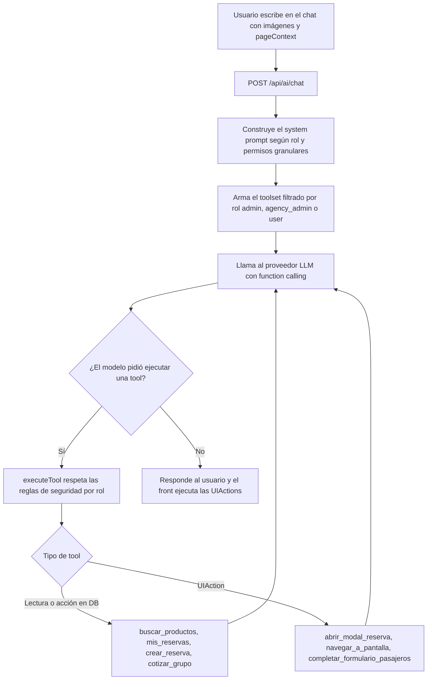

---

## 11. Expiración Automática de Reservas

Un servicio de cron externo (cron-job.org, GitHub Actions, etc.) golpea `GET /api/cron/expire-reservations` cada 5–15 minutos. No usa JWT: se protege con el header `X-Cron-Secret` comparado contra `CRON_SECRET`.

El handler hace dos pasadas sobre las reservas en `bloqueo_temporal`: primero **avisa** las que vencen en menos de 15 minutos y aún no tienen aviso (`expiration_warning_sent_at`), enviando notificación + email y marcando la bandera; luego **expira** las que ya pasaron su `bloqueo_expira_at`, devolviendo la disponibilidad al producto (resta `vendidos`), poniendo reserva y pasajeros en `expirada`, notificando a usuario y admin, enviando email y dejando un `SystemLog`. Responde con la cantidad avisada y expirada.

- Backend: `cron_handler.go` (`ExpireReservations`), documentado en `backend-go/README.md`.

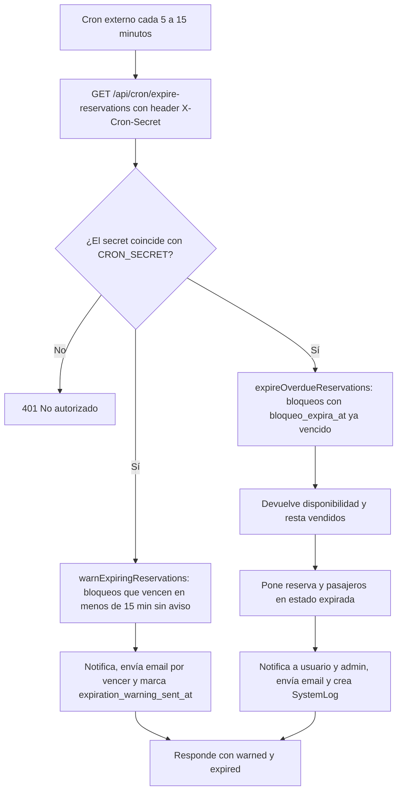

---

## 12. Reportes y Dashboard

El **Dashboard** y **Reportes** (gateados por `REPORTS_VIEW`) consumen métricas del backend. `GetStats` calcula totales del sistema (reservas, ventas de reservas confirmadas, usuarios activos de los últimos 30 días, pasajeros confirmados). Otros endpoints entregan ocupación, top de productos, alertas de riesgo y evoluciones. Los conceptos clave: **Rentabilidad** = `OP × vendidos` y **Riesgo** = `disponibles × neto_1`. La **exportación** entrega un CSV por tipo de entidad.

> Nota: el `backend-go/README.md` documenta los endpoints como `GET /api/analytics/stats` y `GET /api/reports/export`; en el ruteo actual (`main.go`) están implementados como `GET /api/reports/stats` (más los `/api/reports/*`) y la exportación como `GET /api/export/csv/:entityType` (permiso `REPORTS_EXPORT`).

- Backend: `report_handler.go` (`GetStats`, `GetRiskAlerts`, etc.), `analytics_handler.go`, `export_handler.go`.
- Frontend: `frontend/src/pages/Reportes.jsx`, `frontend/src/pages/Dashboard.jsx`.

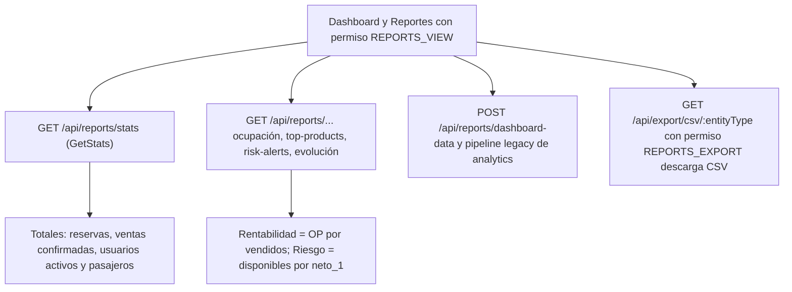

---

## 13. Notificaciones

Los eventos del sistema (nueva reserva, cesión recibida, grupo cotizado/aceptado/confirmado, expiración, etc.) generan `Notification` mediante los helpers `services.Notify*`. El `Sidebar` hace **polling** de `GET /api/notifications/unread-count` cada **20 segundos** y muestra el badge de no leídas.

La pantalla de **Notificaciones** lista los avisos (`GET /api/notifications`) y permite marcarlos como leídos (individual o todos), ocultarlos y —con `NOTIFICATIONS_CREATE`— crear notificaciones manuales.

- Backend: `notification_handler.go`, `services` de notificación.
- Frontend: `frontend/src/pages/Notificaciones.jsx`, polling en `frontend/src/components/ui/Sidebar.jsx`.

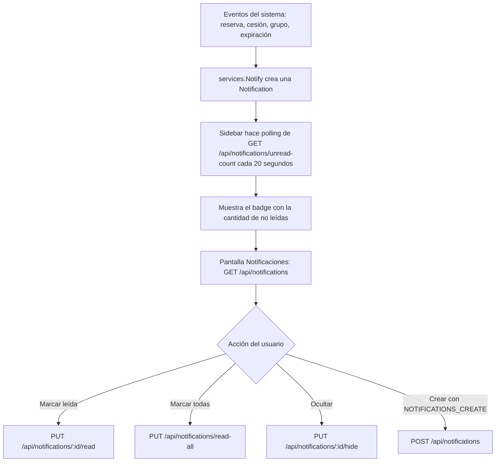

---

## 14. Configuraciones

La sección de configuración agrupa varios módulos, cada uno gateado por su permiso:

- **Ajustes generales**: pares clave-valor vía `GET/PUT /api/settings/:key` (ej. `bloqueo_minutos_default`). Permisos `SETTINGS_VIEW/UPDATE`.
- **Diseño / White-Label**: logo y colores de la agencia (`/api/white-label/config`), usados en la UI y en los itinerarios PDF. Permiso `WHITE_LABEL_*`.
- **Email**: configuración SMTP y plantillas por agencia (`/api/email-config/config`, `/templates`, `/test`, `/send-test`). Permiso `EMAIL_*`.
- **Plantillas de notificación** in-app (`/api/notification-config/templates` y preview). Permiso `NOTIFICATION_TEMPLATES_*`.
- **Config de IA**: alta/edición/prueba de proveedores LLM (`/api/ai/providers`). Permiso `AI_*`.

- Frontend: `frontend/src/pages/Settings.jsx`, `WhiteLabelConfig.jsx`, `EmailConfig.jsx`, `NotificationTemplates.jsx`, `AIConfig.jsx`.

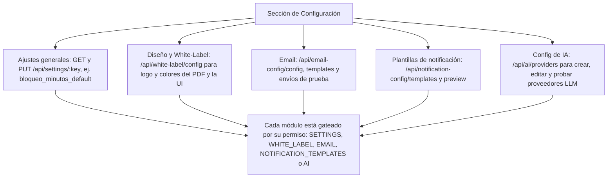
