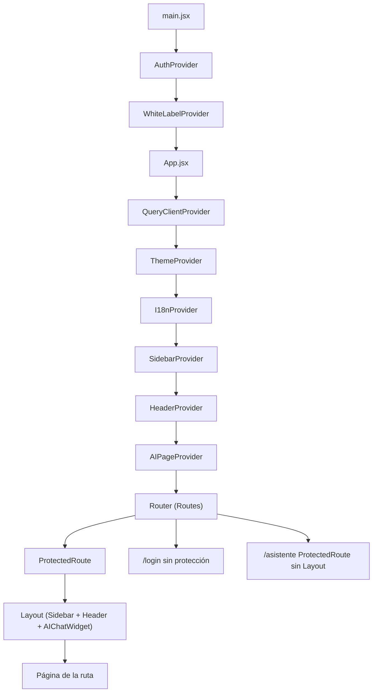
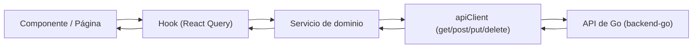

# Frontend

Este documento describe la arquitectura del **frontend** del Sistema de Gestión de Cupos: una **Single Page Application (SPA)** que vive en la carpeta `frontend/` y consume la API de Go (`backend-go/`). Cubre el stack tecnológico, la estructura de carpetas, el enrutamiento y el árbol de providers, las páginas, los contextos globales, la capa de servicios HTTP, los hooks de datos, los componentes clave, la internacionalización y el build/despliegue.


## Índice

1. [Stack tecnológico](#1-stack-tecnológico)
2. [Estructura de carpetas](#2-estructura-de-carpetas)
3. [Enrutamiento y providers](#3-enrutamiento-y-providers)
4. [Páginas](#4-páginas)
5. [Contextos](#5-contextos)
6. [Servicios](#6-servicios)
7. [Hooks](#7-hooks)
8. [Componentes clave](#8-componentes-clave)
9. [Internacionalización](#9-internacionalización)
10. [Build y despliegue](#10-build-y-despliegue)

---

## 1. Stack tecnológico

El frontend está construido con tecnologías modernas del ecosistema React. Basado en `frontend/README.md` y `frontend/package.json`:

- **Biblioteca principal**: [React 19](https://react.dev/).
- **Entorno de compilación**: [Vite](https://vitejs.dev/) (bundler y servidor de desarrollo con HMR).
- **Estilos y layout**: [Tailwind CSS v4](https://tailwindcss.com/), integrado vía `@tailwindcss/vite`.
- **Componentes accesibles**: [Radix UI](https://www.radix-ui.com/) (Accordion, Dialog, Select, Dropdown, Tabs, Switch, Tooltip, etc.), envueltos en `components/ui/` (incluye variantes `shadcn-*`).
- **Formularios y validación**: [React Hook Form](https://react-hook-form.com/) + [Zod](https://zod.dev/) (a través de `@hookform/resolvers`) para validación estricta del lado del cliente.
- **Estado de servidor**: [TanStack React Query v5](https://tanstack.com/query/latest) para fetching, caché y sincronización de datos.
- **Animaciones**: [Framer Motion](https://www.framer.com/motion/).
- **Gráficos**: [Chart.js](https://www.chartjs.org/) y [Recharts](https://recharts.org/) para el dashboard y los reportes analíticos.
- **Internacionalización**: la SPA usa un contexto propio de i18n (ver [sección 9](#9-internacionalización)); `i18next` figura como dependencia.
- **Exportación de datos**: `xlsx` (SheetJS) para Excel y `jspdf` / `jspdf-autotable` para PDF (itinerarios, reportes).
- **Iconografía**: [Lucide React](https://lucide.dev/) y [Heroicons](https://heroicons.com/).

---

## 2. Estructura de carpetas

El código fuente vive en `frontend/src/` y está organizado por responsabilidad:

| Carpeta / archivo | Propósito |
| --- | --- |
| `components/` | Componentes visuales reutilizables (formularios, modales, tablas, PDFs). Incluye las subcarpetas `AIChat/` (widget y pantalla del asistente), `AIExperts/` (expertos/base de conocimiento del LLM), `reports/` (gráficos y tablas de reportes) y `ui/` (primitivos accesibles sobre Radix y variantes `shadcn-*`). |
| `contexts/` | Contextos globales de React: autenticación, tema, idioma, marca blanca, encabezado y contexto de página para la IA. |
| `hooks/` | Custom hooks, en su mayoría envolviendo React Query, más utilidades como toasts y atajos de teclado. |
| `i18n/` | Configuración de internacionalización (`i18n.js`). |
| `lib/` | Inicialización de librerías y utilidades: cliente de React Query, `cva`/`clsx` para clases, helpers de fechas y expiración, secciones de documentación in-app, esquemas de importación, etc. |
| `pages/` | Vistas completas asociadas a las rutas de la aplicación. |
| `schemas/` | Esquemas de validación Zod para formularios. |
| `services/` | Capa HTTP contra la API de Go, centralizada en `apiClient.js`. |
| `styles/` | CSS global (`globals.css`) y utilidades adicionales. |
| `App.jsx` | Enrutamiento principal (React Router) y árbol de providers internos. |
| `main.jsx` | Punto de entrada: monta React en el DOM y envuelve la app con `AuthProvider` y `WhiteLabelProvider`. |
| `index.css` | Archivo de entrada de estilos de Tailwind CSS. |

```text
frontend/src/
├── components/
│   ├── AIChat/          # Asistente IA (widget flotante + pantalla completa)
│   ├── AIExperts/       # Expertos / base de conocimiento del LLM
│   ├── reports/         # Gráficos y tablas del cockpit de reportes
│   └── ui/              # Primitivos accesibles (Radix + shadcn-*)
├── contexts/            # Estado global (Auth, Theme, I18n, WhiteLabel, Header, AIPage)
├── hooks/               # Custom hooks (React Query, toasts, atajos)
├── i18n/                # Configuración de internacionalización
├── lib/                 # Inicialización de librerías y utilidades
├── pages/               # Vistas por ruta
├── schemas/             # Esquemas Zod
├── services/            # Capa HTTP contra la API de Go
├── styles/              # CSS global
├── App.jsx              # Enrutamiento + providers internos
├── main.jsx             # Entry point (AuthProvider + WhiteLabelProvider)
└── index.css            # Entrada de Tailwind
```

---

## 3. Enrutamiento y providers

El árbol de providers se arma en dos niveles. En `frontend/src/main.jsx`, la app se envuelve con `AuthProvider` (sesión y permisos) y `WhiteLabelProvider` (marca blanca). Dentro, `frontend/src/App.jsx` anida el resto de los providers alrededor del `Router` de React Router DOM: `QueryClientProvider` → `ThemeProvider` → `I18nProvider` → `SidebarProvider` → `HeaderProvider` → `AIPageProvider` → `Router`.

Cada ruta protegida se compone con `ProtectedRoute` (redirige a `/login` si no hay usuario en sesión) y `Layout` (sidebar + header + widget de IA). El chat de IA a pantalla completa (`/asistente`) es la excepción: se monta dentro de `ProtectedRoute` pero **fuera** de `Layout`, para maximizar el espacio.



### Tabla de rutas → página

Rutas definidas en `frontend/src/App.jsx`:

| Ruta | Página | Notas |
| --- | --- | --- |
| `/login` | `Login.jsx` | Pública (sin `ProtectedRoute`). |
| `/` y `/dashboard` | `Dashboard.jsx` | Panel principal. |
| `/availability` | `Availability.jsx` | Catálogo de disponibilidad / creación de reserva. |
| `/requests` | `Requests.jsx` | Solicitudes. |
| `/confirmations` | `Confirmations.jsx` | Confirmaciones. |
| `/productos` | `GestionProductos.jsx` | Gestión de productos. |
| `/grupos` | `GestionGrupos.jsx` | Grupos y vuelos a medida. |
| `/reservas` | `GestionReservas.jsx` | Gestión de reservas. |
| `/nominas` | `GestionNominas.jsx` | Nóminas de pasajeros. |
| `/agencias` | `GestionAgencias.jsx` | Gestión de agencias. |
| `/temas` | `GestionTemas.jsx` | Gestión de temas. |
| `/usuarios` | `GestionUsuarios.jsx` | Usuarios (RBAC). |
| `/roles` | `GestionRoles.jsx` | Roles (RBAC). |
| `/permisos` | `GestionPermisos.jsx` | Permisos (RBAC). |
| `/panel-control` | `PanelControl.jsx` | Panel de control. |
| `/reportes` | `Reportes.jsx` | Cockpit de reportes y analíticas. |
| `/logs` | `LogsDelSitio.jsx` | Logs del sitio. |
| `/notificaciones` | `Notificaciones.jsx` | Bandeja de notificaciones. |
| `/settings` | `Settings.jsx` | Ajustes generales. |
| `/marca-blanca` | `WhiteLabelConfig.jsx` | Configuración de marca blanca. |
| `/email-config` | `EmailConfig.jsx` | Configuración de email. |
| `/notification-config` | `NotificationTemplates.jsx` | Plantillas de notificación. |
| `/config-ia` | `AIConfig.jsx` | Configuración de IA. |
| `/asistente` | `AIChatPage.jsx` | Chat de IA a pantalla completa (fuera de `Layout`). |
| `/profile` | `Profile.jsx` | Perfil del usuario. |
| `/documentacion` | — | Redirige a `/documentacion/:section` (sección por defecto). |
| `/documentacion/:section` | `Documentacion.jsx` | Documentación in-app por sección. |
| `/test` | `TestPage.jsx` | Página de pruebas (protegida). |
| `/test-public` | `TestPage.jsx` | Página de pruebas sin protección. |

---

## 4. Páginas

Las vistas viven en `frontend/src/pages/`. Cada una corresponde a una o más rutas de la [tabla anterior](#3-enrutamiento-y-providers):

- **Login** (`Login.jsx`): formulario de acceso; autentica contra la API y guarda la sesión.
- **Dashboard** (`Dashboard.jsx`): panel principal con KPIs y gráficos de resumen.
- **Availability** (`Availability.jsx`): catálogo de productos disponibles y punto de entrada para crear reservas.
- **Requests** (`Requests.jsx`): solicitudes pendientes.
- **Confirmations** (`Confirmations.jsx`): confirmaciones de reservas.
- **GestionProductos** (`GestionProductos.jsx`): alta, edición, borrado y carga masiva de productos.
- **GestionGrupos** (`GestionGrupos.jsx`): grupos y flujo de vuelos a medida.
- **GestionReservas** (`GestionReservas.jsx`): administración de reservas y sus estados.
- **GestionNominas** (`GestionNominas.jsx`): nóminas de pasajeros.
- **GestionUsuarios** (`GestionUsuarios.jsx`): gestión de usuarios.
- **GestionRoles** (`GestionRoles.jsx`): definición de roles (globales o por agencia).
- **GestionPermisos** (`GestionPermisos.jsx`): catálogo de permisos del sistema.
- **GestionAgencias** (`GestionAgencias.jsx`): administración de agencias.
- **GestionTemas** (`GestionTemas.jsx`): gestión de temas visuales.
- **Reportes** (`Reportes.jsx`): cockpit ejecutivo con gráficos y tablas analíticas (ver `components/reports/`).
- **LogsDelSitio** (`LogsDelSitio.jsx`): auditoría/logs traducidos a lenguaje legible para administradores.
- **Notificaciones** (`Notificaciones.jsx`): bandeja de notificaciones del usuario.
- **Settings** (`Settings.jsx`): ajustes generales del sistema.
- **WhiteLabelConfig** (`WhiteLabelConfig.jsx`): configuración de marca blanca (identidad, colores, tipografías).
- **EmailConfig** (`EmailConfig.jsx`): configuración del servicio de email.
- **NotificationTemplates** (`NotificationTemplates.jsx`): plantillas de notificación.
- **AIConfig** (`AIConfig.jsx`): configuración de proveedores y acciones de IA (solo administradores).
- **AIChatPage** (`AIChatPage.jsx`): chat de IA a pantalla completa, con su propio topbar y barra lateral de conversaciones.
- **Profile** (`Profile.jsx`): perfil y datos de la cuenta.
- **PanelControl** (`PanelControl.jsx`): panel de control administrativo.
- **Documentacion** (`Documentacion.jsx`): documentación in-app renderizada por secciones (una ruta por sección).

> `TestPage.jsx` es una vista auxiliar de pruebas (rutas `/test` y `/test-public`).

---

## 5. Contextos

Los contextos globales (en `frontend/src/contexts/`) concentran el estado transversal de la aplicación:

- **AuthContext** (`AuthContext.jsx`): maneja la **autenticación** y los **permisos**. Guarda el usuario en sesión (token JWT y datos en `localStorage` vía `apiClient`), y tras el login llama a `GET /users/me/permissions` para cachear los códigos de permiso. Expone `signIn`, `signOut` y los helpers `can(code)` / `canModule(module, action)` que replican el bypass de `admin` del backend, de modo que la UI se filtre sin repetir la lógica de roles en cada componente.
- **ThemeContext** (`ThemeContext.jsx`): estado del **tema** claro/oscuro. Inicializa desde `localStorage` o la preferencia del sistema, aplica/quita la clase `dark` en el `<html>` y persiste el cambio (`toggleTheme`, `setTheme`).
- **I18nContext** (`I18nContext.jsx`): estado del **idioma** (`locale`, es/en). Expone `t(key)` para traducir a partir de un diccionario embebido y `changeLocale`, persistiendo la preferencia en `localStorage`.
- **WhiteLabelContext** (`WhiteLabelContext.jsx`): configuración de **marca blanca** multi-tenant (identidad, colores, tipografías, botones, sidebar, layout). Trae la configuración vía `whiteLabelService` y la aplica como variables CSS; incluye una configuración por defecto.
- **HeaderContext** (`HeaderContext.jsx`): estado del **encabezado** de la vista actual (título, descripción, ícono, badge, acción), que el `Layout` renderiza y cada página actualiza con `setHeaderData`.
- **AIPageContext** (`AIPageContext.jsx`): contexto de **página para la IA**. Publica en qué pantalla está el usuario (`pageContext`) y permite que cada página registre handlers de acción (`registerActionHandlers`) para que el asistente ejecute `ui_actions` reales (abrir el modal de reserva, completar el formulario de pasajeros) devueltas por el backend.

---

## 6. Servicios

La capa de servicios (`frontend/src/services/`) encapsula toda la comunicación HTTP contra la API de Go. El núcleo es **`apiClient.js`**: una clase con métodos `get`/`post`/`put`/`delete` que resuelve la URL base desde `VITE_API_URL` (normalizando la barra final), adjunta el token `Bearer` desde `localStorage`, envía cookies (`credentials: 'include'`), maneja `FormData` y parsea las respuestas de forma defensiva (leyendo el body como texto para dar errores legibles ante respuestas no-JSON). También administra la sesión (`getToken`/`setToken`, `getSessionUser`/`setSessionUser`, `clearSession`).

El resto de los servicios exponen métodos estáticos por dominio que delegan en `apiClient`:



Servicios disponibles:

- `authService` — login y autenticación.
- `productService` — CRUD de productos, carga masiva y compartir/visibilidad entre agencias.
- `reservationService` — reservas y sus estados.
- `groupService` — grupos y vuelos a medida.
- `transferService` — cesión de cupos entre agencias.
- `agencyService` — agencias.
- `userService` — usuarios.
- `roleService` — roles (RBAC).
- `permissionService` — permisos (RBAC).
- `reportService` — datos de reportes y dashboard.
- `notificationService` — notificaciones.
- `notificationTemplatesService` — plantillas de notificación.
- `aiService` — asistente IA (chat, sesiones, expertos).
- `whiteLabelService` — configuración de marca blanca.
- `emailConfigService` / `emailTemplateService` — configuración y plantillas de email.
- `logService` — logs del sitio.
- `exportService` — exportación de datos (Excel/PDF).
- `alertRuleService` — reglas de alerta.
- `backofficeService` — utilidades de backoffice.

---

## 7. Hooks

Los custom hooks (`frontend/src/hooks/`) se apoyan en TanStack React Query para el estado de servidor: definen `queryKey`, `staleTime`/`gcTime` e invalidan la caché tras las mutaciones. El `QueryClient` global se configura en `lib/react-query.js`.

- `useProducts` — lista, detalle y mutaciones (crear/editar/borrar) de productos.
- `useReports` — datos de reportes y dashboard.
- `useAgencies` — agencias.
- `useGroups` — grupos y vuelos a medida.
- `usePermissions` — permisos (RBAC).
- `useRoles` — roles (RBAC).
- `useUsers` — usuarios.
- `useAIChat` — estado del asistente IA (mensajes, sesiones).
- `useKeyboardShortcut` — registro de atajos de teclado (utilidad de UI).
- `use-toast` — sistema de notificaciones toast (utilidad de UI).

---

## 8. Componentes clave

Componentes destacados en `frontend/src/components/`:

- **`Layout.jsx`**: estructura general de la app autenticada — combina `Sidebar`, encabezado (desde `HeaderContext`) y el widget flotante de IA (`AIChat/AIChatWidget.jsx`).
- **`ProtectedRoute.jsx`**: guarda de rutas; muestra un spinner mientras carga la sesión y redirige a `/login` si no hay usuario.
- **`ui/Sidebar.jsx`**: navegación lateral. Los ítems de administración declaran el permiso `MODULO_ACCION` que los habilita, de modo que el menú se **filtra por permisos RBAC** (un `admin` los ve todos).
- **`Modal.jsx`**: modal genérico reutilizable.
- **Formularios**: `ProductForm.jsx`, `UserForm.jsx`, `GroupForm.jsx` (React Hook Form + Zod), más `GroupOptionsFields.jsx` y `PermissionSelector.jsx`.
- **`TransferModal.jsx`**: cesión de cupos entre agencias.
- **`ShareProductModal.jsx`**: compartir la visibilidad de un producto con otras agencias.
- **`ItineraryPDF.jsx` / `ItineraryTable.jsx`**: generación y presentación de itinerarios (PDF con `jspdf`).
- **`CountdownTimer.jsx`**: cuenta regresiva de los bloqueos temporales de reserva.
- **`DashboardCharts.jsx`**: gráficos del dashboard (Chart.js/Recharts).
- **`ExportButton.jsx`**: exportación a Excel/PDF.
- **`GlobalSearch.jsx`**: búsqueda global.
- **`ProductBulkUpload.jsx`**, **`AdvancedFilters.jsx`**, **`OnboardingGuide.jsx`**, **`KeyboardShortcuts.jsx`**, **`WhiteLabelPreviewModal.jsx`**, **`ThemeToggle.jsx`**, **`LanguageSelector.jsx`**, **`ToastNotification.jsx`** y estados auxiliares (`EmptyState.jsx`, `SkeletonTable.jsx`).
- **`ui/`**: primitivos accesibles sobre Radix (`Dialog`, `Select`, `DropdownMenu`, `Tooltip`, `Table`, `Card`, `Button`, etc.) y sus variantes `shadcn-*`.
- **`reports/`**: piezas del cockpit de reportes (`KPIsRow`, `EvolutionChart`, `OccupancyHeatmap`, `RiskAlertsTable`, `ProductPerformanceTable`, `TopDestinationsChart`, `DataTable`, etc.).
- **`AIChat/`**: interfaz del asistente — `AIChatWidget` (flotante), `AIChatWindow`, `AIChatMessage`, `AIChatInput`, `AIChatTopbar`, `AIChatSessionsSidebar`, `AIChatItineraryResult`, `ExpertPicker`.
- **`AIExperts/`**: gestión de expertos/base de conocimiento del LLM — `ExpertsTab`, `ExpertDocumentsPanel`.

---

## 9. Internacionalización

La internacionalización se implementa mediante el **`I18nContext`** propio de la aplicación (`contexts/I18nContext.jsx`), que contiene un diccionario de traducciones (español e inglés) y expone `t(key)`, `locale` y `changeLocale`, persistiendo el idioma elegido en `localStorage` y actualizando el atributo `lang` del documento. El archivo `i18n/i18n.js` re-exporta `I18nProvider` como `i18n` para mantener compatibilidad con los imports existentes; `i18next` figura como dependencia en `package.json`.

El componente **`LanguageSelector.jsx`** consume `useI18n()` y permite cambiar entre español (`es`) e inglés (`en`) llamando a `changeLocale`.

---

## 10. Build y despliegue

Scripts definidos en `frontend/package.json`:

| Script | Descripción |
| --- | --- |
| `npm run dev` | Servidor de desarrollo de Vite con HMR (expuesto en red local, `--host`). |
| `npm run build` | Compila y optimiza la aplicación para producción en `dist/`. |
| `npm run preview` | Previsualiza localmente la build de producción. |
| `npm run lint` | Análisis de calidad de código con ESLint. |
| `npm run format` | Formatea el código con Prettier. |

**Variables de entorno**: el frontend lee `VITE_API_URL` para apuntar a la API de Go (por defecto `http://localhost:5001/api` si no está definida; `apiClient` normaliza la barra final). Todas las variables expuestas al cliente deben llevar el prefijo `VITE_`.

**Despliegue (SPA)**: el archivo `frontend/vercel.json` define un rewrite que redirige todas las rutas a `index.html`, comportamiento necesario para el enrutamiento del lado del cliente con React Router:

```json
{
  "rewrites": [
    { "source": "/(.*)", "destination": "/index.html" }
  ]
}
```
