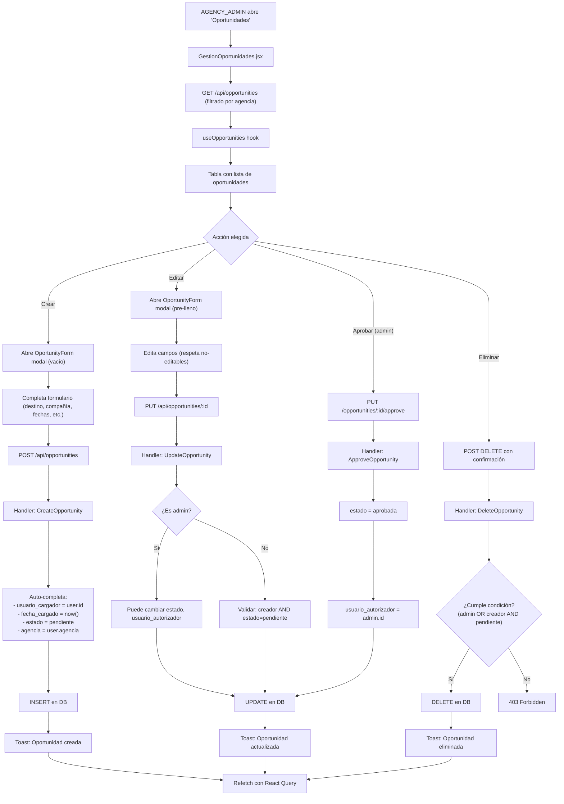
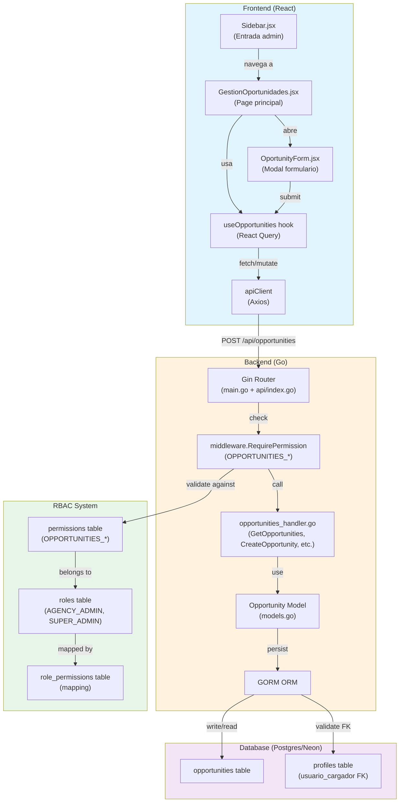
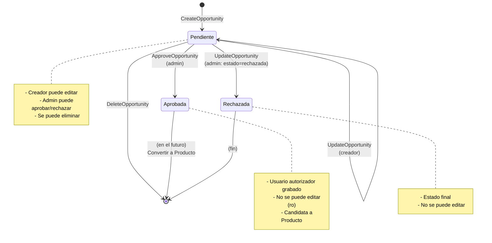
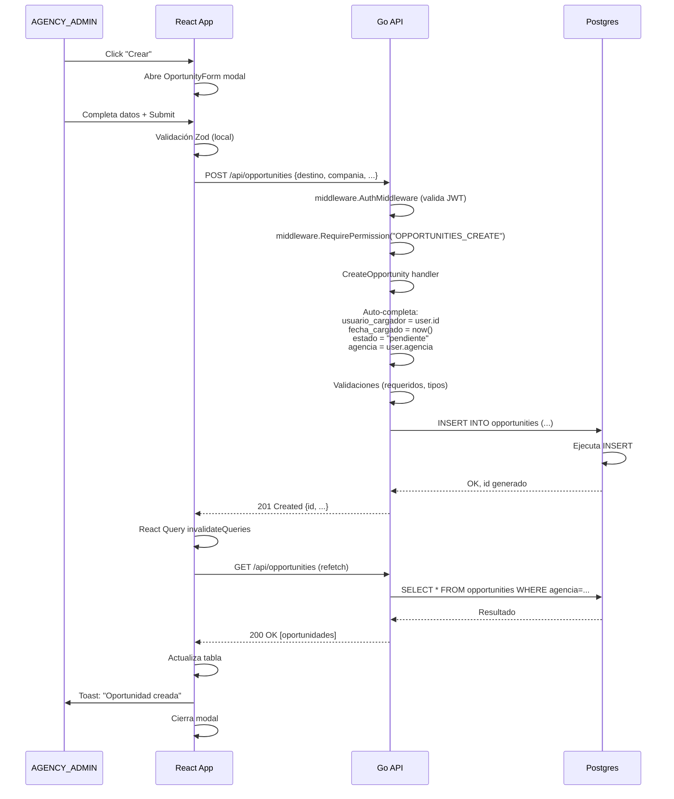

# Diagramas y Flujos: Módulo "Oportunidades"

---

## 1. Flujo de Datos - Ciclo Completo de Oportunidad



---

## 2. Arquitectura: Componentes y Servicios



---

## 3. Máquina de Estados: Estados de Oportunidad



---

## 4. Matriz de Permisos y Acciones

```
┌────────────────────┬──────────────┬──────────────┬────────────┐
│ Acción             │ AGENCY_ADMIN  │ SALES_AGENT  │ ADMIN      │
├────────────────────┼──────────────┼──────────────┼────────────┤
│ Ver propias        │ ✓            │ ✗ (403)      │ ✓ (todas)  │
│ Crear              │ ✓            │ ✗ (403)      │ ✓          │
│ Editar propia*     │ ✓ (pending)  │ ✗ (403)      │ ✓ (any)    │
│ Editar otra agenc. │ ✗ (403)      │ ✗ (403)      │ ✓          │
│ Eliminar propia*   │ ✓ (pending)  │ ✗ (403)      │ ✓          │
│ Eliminar otra      │ ✗ (403)      │ ✗ (403)      │ ✓          │
│ Aprobar/Rechazar   │ ✗            │ ✗ (403)      │ ✓          │
│ Ver usuario_autor. │ N/A          │ N/A          │ ✓          │
└────────────────────┴──────────────┴──────────────┴────────────┘

* Condiciones adicionales:
  - Editar: solo si es creador (usuario_cargador) Y estado=pendiente
  - Eliminar: admin siempre, o creador con estado=pendiente
```

---

## 5. Flujo HTTP: Creación de Oportunidad



---

## 6. Estructura de Directorios (Archivos Nuevos)

```
form-cupos/
├── backend-go/
│   ├── cmd/api/
│   │   └── main.go                       [ACTUALIZAR: agregar rutas]
│   ├── api/
│   │   └── index.go                      [ACTUALIZAR: agregar rutas]
│   ├── migrations/
│   │   └── 002_create_opportunities.sql  [NUEVO]
│   └── pkg/
│       ├── database/
│       │   └── db.go                     [ACTUALIZAR: AutoMigrate + seedRBAC]
│       ├── handlers/
│       │   └── opportunities_handler.go  [NUEVO]
│       ├── middleware/
│       │   └── auth.go                   [Sin cambios: RequirePermission existente]
│       └── models/
│           └── models.go                 [ACTUALIZAR: agregar Opportunity struct]
│
├── frontend/
│   └── src/
│       ├── components/
│       │   └── OportunityForm.jsx        [NUEVO]
│       ├── contexts/
│       │   └── AuthContext.jsx           [Sin cambios]
│       ├── hooks/
│       │   └── useOpportunities.ts       [NUEVO]
│       ├── lib/
│       │   └── permissionModules.js      [ACTUALIZAR: agregar OPPORTUNITIES]
│       ├── pages/
│       │   └── GestionOportunidades.jsx  [NUEVO]
│       ├── App.jsx                       [ACTUALIZAR: agregar ruta]
│       └── components/ui/
│           └── Sidebar.jsx               [ACTUALIZAR: agregar entrada admin]
│
└── plans/
    ├── PLAN_OPORTUNIDADES_CRUD.md        [NUEVO: detallado]
    ├── OPORTUNIDADES_RESUMEN.md          [NUEVO: resumen ejecutivo]
    └── DIAGRAMAS_OPORTUNIDADES.md        [NUEVO: este archivo]
```

---

## 7. Validaciones en el Formulario (Zod Schema)

```javascript
// frontend/src/schemas/opportunitySchema.ts
export const opportunitySchema = z.object({
  agencia: z.string().min(1, "Agencia requerida"),
  destino: z.string().min(1, "Destino requerido"),
  compania: z.string().min(1, "Compañía requerida"),
  temporada: z.string().optional(),
  validez: z.date().optional(),
  fecha_salida: z.date()
    .min(new Date(), "Fecha salida no puede ser en el pasado"),
  fecha_llegada: z.date().optional(),
  total_lugares: z.number()
    .int()
    .min(0, "Lugares debe ser >= 0"),
  total_liberados: z.number()
    .int()
    .min(0, "Liberados debe ser >= 0"),
  neto_1: z.number().optional(),
  neto_2: z.number().optional(),
  estado_interno: z.string().optional(),
  // Admin only:
  estado: z.enum(['pendiente', 'aprobada', 'rechazada']).optional(),
  usuario_autorizador: z.string().uuid().optional(),
});

// Validación cruzada (server-side en Go):
// - fecha_llegada >= fecha_salida (si ambas presentes)
// - total_liberados <= total_lugares
// - usuario_autorizador debe existir en profiles
```

---

## 8. Integración con Vault de Obsidian

**Archivos a actualizar en `app-cupos/`:**

1. **`005 - Arquitectura y Datos/Modelo de Datos.md`**
   - Nueva sección: **Oportunidades (`opportunities`)**
   - Explicar relación con `Product`
   - Trazabilidad de usuario_cargador/usuario_autorizador

2. **`003 - Funcionalidades/Flujos de Funcionalidades.md`**
   - Nueva sección: **19. Oportunidades (Análisis de Pedidos)**
   - Diagrama de máquina de estados
   - Endpoints y permisos
   - Scoping de agencia

3. **`006 - Operación y Mantenimiento/Gotchas y Reglas de Oro.md`**
   - Agregar nota si alguna regla nueva emerge (ej. "Oportunidades no se ven hasta que estén en la BD")

4. **`log.md`**
   - Entrada: `[2026-08-12] Alta: Módulo Oportunidades (CRUD, RBAC, scoping agencia)`

---

## 9. Checklist de Testing Automático (Pytest/Go)

```go
// backend-go/tests/opportunities_test.go (nuevo)

func TestCreateOpportunity_AsAgencyAdmin(t *testing.T) {
  // Arrange
  adminToken := getJWT("agency_admin", "test_agencia")
  
  // Act
  response := POST("/api/opportunities",
    Body{
      Destino: "NYC",
      Compania: "AA",
      FechaSalida: "2026-09-15",
      TotalLugares: 50,
    },
    Headers{"Authorization": "Bearer " + adminToken},
  )
  
  // Assert
  AssertStatusCode(response, 201)
  AssertNotNil(response.ID)
  AssertEqual(response.UsuarioCargador, adminUserID)
  AssertEqual(response.Estado, "pendiente")
  AssertEqual(response.Agencia, "test_agencia")
}

func TestCreateOpportunity_AsSalesAgent_Forbidden(t *testing.T) {
  // Un SALES_AGENT no tiene permiso OPPORTUNITIES_CREATE
  agentToken := getJWT("agency_user", "test_agencia")
  response := POST("/api/opportunities", Body{...}, Headers{"Authorization": "Bearer " + agentToken})
  AssertStatusCode(response, 403)
}

func TestUpdateOpportunity_OnlyCreatorOrAdmin(t *testing.T) {
  // Creador puede editar si status=pendiente
  // Otro usuario: 403
  // Admin: siempre puede
}

func TestApproveOpportunity_AdminOnly(t *testing.T) {
  // Solo admin puede cambiar estado a aprobada
  // Otros: 403
}

func TestDeleteOpportunity_CreatorOrAdmin(t *testing.T) {
  // Creador puede eliminar si status=pendiente
  // Admin: siempre
  // Otros: 403
}
```

---

## 10. Checklist de Prueba Manual (QA)

### Happy Path: Crear → Editar → Aprobar

1. [ ] Loguearse como AGENCY_ADMIN de "Agencia Test"
2. [ ] Navegar a "Oportunidades" (debe aparecer en sidebar)
3. [ ] Click "Crear"
4. [ ] Completar form: Destino=NYC, Compañía=AA, Salida=2026-09-15, etc.
5. [ ] Submit
6. [ ] Verificar que aparece en la tabla
7. [ ] Verificar que estado=`pendiente`
8. [ ] Verificar que `usuario_cargador`=correo del logged
9. [ ] Click "Editar", cambiar Neto1 a 500, guardar
10. [ ] Loguearse como ADMIN (otra pestaña)
11. [ ] Navegar a "Oportunidades"
12. [ ] Ver oportunidad de "Agencia Test"
13. [ ] Click "Aprobar"
14. [ ] Verificar estado=`aprobada`
15. [ ] Verificar `usuario_autorizador`=correo del admin
16. [ ] Loguearse como AGENCY_ADMIN
17. [ ] Intentar editar oportunidad aprobada (debe fallar o ser read-only)

### Edge Cases

1. [ ] SALES_AGENT intenta acceder a /oportunidades → 403 o "Acceso restringido"
2. [ ] SALES_AGENT intenta POST /api/opportunities → 403
3. [ ] AGENCY_ADMIN intenta eliminar oportunidad aprobada → error "No se puede eliminar en este estado"
4. [ ] AGENCY_ADMIN de Agencia A ve oportunidades de Agencia B → 404 (ver GET error)
5. [ ] Crear oportunidad con `fecha_llegada < fecha_salida` → validation error
6. [ ] Crear con `total_liberados > total_lugares` → validation error (server-side)

---

**Fin del documento de diagramas y flujos.**

Versión 1.0 — Listo para desarrollo.
