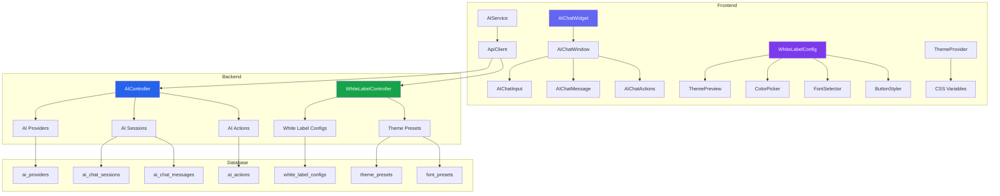

# Plan de Implementación: Marca Blanca Profesional + Chat IA

## Resumen Ejecutivo

Este plan detalla la implementación de dos mejoras mayores al sistema de Gestión de Cupos:

1. **Sistema de Marca Blanca Profesional (White-Label)** - Configuración completa de temas, tipografías, botones, colores, logos, emails, y personalización total de la interfaz por agencia.
2. **Chat IA Integrado** - Asistente de inteligencia artificial capaz de realizar acciones automáticas, con configuración multi-proveedor (OpenAI, Anthropic, Google, etc.).

---

## Fase 1: Sistema de Marca Blanca Profesional

### 1.1 Base de Datos - Nuevas Tablas y Columnas

#### Tabla: `white_label_configs`
```sql
CREATE TABLE IF NOT EXISTS public.white_label_configs (
    id UUID DEFAULT gen_random_uuid() PRIMARY KEY,
    agency_id UUID REFERENCES public.agencies(id) ON DELETE CASCADE,
    
    -- Identidad Visual
    company_name VARCHAR(255),
    company_tagline TEXT,
    logo_url TEXT,
    logo_dark_url TEXT,
    favicon_url TEXT,
    og_image_url TEXT,
    
    -- Paleta de Colores
    primary_color VARCHAR(7) DEFAULT '#3b82f6',
    primary_hover_color VARCHAR(7) DEFAULT '#2563eb',
    secondary_color VARCHAR(7) DEFAULT '#64748b',
    secondary_hover_color VARCHAR(7) DEFAULT '#475569',
    accent_color VARCHAR(7) DEFAULT '#f59e0b',
    background_color VARCHAR(7) DEFAULT '#f8fafc',
    surface_color VARCHAR(7) DEFAULT '#ffffff',
    text_primary_color VARCHAR(7) DEFAULT '#0f172a',
    text_secondary_color VARCHAR(7) DEFAULT '#64748b',
    border_color VARCHAR(7) DEFAULT '#e2e8f0',
    success_color VARCHAR(7) DEFAULT '#22c55e',
    warning_color VARCHAR(7) DEFAULT '#f59e0b',
    error_color VARCHAR(7) DEFAULT '#ef4444',
    info_color VARCHAR(7) DEFAULT '#3b82f6',
    
    -- Tipografías
    font_heading VARCHAR(100) DEFAULT 'Inter',
    font_body VARCHAR(100) DEFAULT 'Inter',
    font_mono VARCHAR(100) DEFAULT 'JetBrains Mono',
    font_size_base VARCHAR(10) DEFAULT '16px',
    font_weight_normal INTEGER DEFAULT 400,
    font_weight_medium INTEGER DEFAULT 500,
    font_weight_bold INTEGER DEFAULT 700,
    
    -- Botones
    button_radius VARCHAR(10) DEFAULT '0.5rem',
    button_shadow VARCHAR(50) DEFAULT '0 1px 2px 0 rgb(0 0 0 / 0.05)',
    button_hover_scale VARCHAR(10) DEFAULT '1.02',
    button_transition VARCHAR(50) DEFAULT 'all 0.2s ease',
    
    -- Sidebar
    sidebar_bg_color VARCHAR(7) DEFAULT '#0f172a',
    sidebar_text_color VARCHAR(7) DEFAULT '#e2e8f0',
    sidebar_active_bg VARCHAR(7) DEFAULT '#ffffff',
    sidebar_active_text VARCHAR(7) DEFAULT '#0f172a',
    sidebar_width VARCHAR(10) DEFAULT '320px',
    sidebar_collapsed_width VARCHAR(10) DEFAULT '80px',
    
    -- Layout
    border_radius_sm VARCHAR(10) DEFAULT '0.25rem',
    border_radius_md VARCHAR(10) DEFAULT '0.5rem',
    border_radius_lg VARCHAR(10) DEFAULT '0.75rem',
    border_radius_xl VARCHAR(10) DEFAULT '1rem',
    shadow_sm VARCHAR(100) DEFAULT '0 1px 2px 0 rgb(0 0 0 / 0.05)',
    shadow_md VARCHAR(100) DEFAULT '0 4px 6px -1px rgb(0 0 0 / 0.1)',
    shadow_lg VARCHAR(100) DEFAULT '0 10px 15px -3px rgb(0 0 0 / 0.1)',
    
    -- Emails
    email_header_logo_url TEXT,
    email_footer_text TEXT,
    email_support_url TEXT,
    
    -- Legal
    legal_company_name VARCHAR(255),
    legal_address TEXT,
    legal_phone VARCHAR(50),
    legal_email VARCHAR(255),
    terms_url TEXT,
    privacy_url TEXT,
    
    -- Configuracion
    is_active BOOLEAN DEFAULT TRUE,
    created_at TIMESTAMPTZ DEFAULT NOW(),
    updated_at TIMESTAMPTZ DEFAULT NOW(),
    
    UNIQUE(agency_id)
);
```

#### Tabla: `font_presets`
```sql
CREATE TABLE IF NOT EXISTS public.font_presets (
    id SERIAL PRIMARY KEY,
    name VARCHAR(100) NOT NULL,
    heading_font VARCHAR(100) NOT NULL,
    body_font VARCHAR(100) NOT NULL,
    preview_url TEXT,
    is_google_font BOOLEAN DEFAULT TRUE,
    created_at TIMESTAMPTZ DEFAULT NOW()
);

-- Presets predefinidos
INSERT INTO public.font_presets (name, heading_font, body_font, preview_url) VALUES
('Moderno', 'Inter', 'Inter', 'https://fonts.google.com/specimen/Inter'),
('Elegante', 'Playfair Display', 'Source Sans Pro', 'https://fonts.google.com'),
('Corporativo', 'Roboto', 'Roboto', 'https://fonts.google.com/specimen/Roboto'),
('Creativo', 'Poppins', 'Open Sans', 'https://fonts.google.com'),
('Minimalista', 'DM Sans', 'DM Sans', 'https://fonts.google.com'),
('Tecnologico', 'Space Grotesk', 'Inter', 'https://fonts.google.com');
```

#### Tabla: `button_presets`
```sql
CREATE TABLE IF NOT EXISTS public.button_presets (
    id SERIAL PRIMARY KEY,
    name VARCHAR(100) NOT NULL,
    border_radius VARCHAR(10) NOT NULL,
    shadow VARCHAR(100),
    hover_effect VARCHAR(50),
    preview_css TEXT,
    created_at TIMESTAMPTZ DEFAULT NOW()
);

INSERT INTO public.button_presets (name, border_radius, shadow, hover_effect) VALUES
('Flat', '0.375rem', 'none', 'opacity'),
('Rounded', '9999px', '0 1px 2px rgb(0 0 0 / 0.05)', 'scale'),
('Shadowed', '0.5rem', '0 4px 6px -1px rgb(0 0 0 / 0.1)', 'lift'),
('Outlined', '0.375rem', 'none', 'border-color'),
('Gradient', '0.5rem', '0 2px 4px rgb(0 0 0 / 0.1)', 'gradient-shift'),
('Glass', '0.75rem', '0 8px 32px rgb(0 0 0 / 0.1)', 'blur');
```

#### Tabla: `theme_presets`
```sql
CREATE TABLE IF NOT EXISTS public.theme_presets (
    id SERIAL PRIMARY KEY,
    name VARCHAR(100) NOT NULL,
    label VARCHAR(100) NOT NULL,
    colors JSONB NOT NULL,
    preview_image TEXT,
    is_dark BOOLEAN DEFAULT FALSE,
    created_at TIMESTAMPTZ DEFAULT NOW()
);

-- Temas predefinidos (Light)
INSERT INTO public.theme_presets (name, label, colors, is_dark) VALUES
('corporate-blue', 'Corporativo Azul', '{
    "primary": "#2563eb",
    "primary_hover": "#1d4ed8",
    "secondary": "#64748b",
    "accent": "#3b82f6",
    "background": "#f8fafc",
    "surface": "#ffffff",
    "text_primary": "#0f172a",
    "text_secondary": "#64748b",
    "border": "#e2e8f0",
    "success": "#22c55e",
    "warning": "#f59e0b",
    "error": "#ef4444"
}', FALSE),

('forest-green', 'Bosque Verde', '{
    "primary": "#16a34a",
    "primary_hover": "#15803d",
    "secondary": "#6b7280",
    "accent": "#84cc16",
    "background": "#f0fdf4",
    "surface": "#ffffff",
    "text_primary": "#14532d",
    "text_secondary": "#6b7280",
    "border": "#bbf7d0",
    "success": "#22c55e",
    "warning": "#f59e0b",
    "error": "#ef4444"
}', FALSE),

('royal-purple', 'Púrpura Real', '{
    "primary": "#7c3aed",
    "primary_hover": "#6d28d9",
    "secondary": "#6b7280",
    "accent": "#a78bfa",
    "background": "#faf5ff",
    "surface": "#ffffff",
    "text_primary": "#1e1b4b",
    "text_secondary": "#6b7280",
    "border": "#e9d5ff",
    "success": "#22c55e",
    "warning": "#f59e0b",
    "error": "#ef4444"
}', FALSE),

('sunset-orange', 'Naranja Atardecer', '{
    "primary": "#ea580c",
    "primary_hover": "#c2410c",
    "secondary": "#6b7280",
    "accent": "#fb923c",
    "background": "#fff7ed",
    "surface": "#ffffff",
    "text_primary": "#431407",
    "text_secondary": "#6b7280",
    "border": "#fed7aa",
    "success": "#22c55e",
    "warning": "#f59e0b",
    "error": "#ef4444"
}', FALSE);

-- Temas predefinidos (Dark)
INSERT INTO public.theme_presets (name, label, colors, is_dark) VALUES
('dark-classic', 'Oscuro Clásico', '{
    "primary": "#3b82f6",
    "primary_hover": "#60a5fa",
    "secondary": "#6b7280",
    "accent": "#8b5cf6",
    "background": "#0f172a",
    "surface": "#1e293b",
    "text_primary": "#f1f5f9",
    "text_secondary": "#94a3b8",
    "border": "#334155",
    "success": "#22c55e",
    "warning": "#f59e0b",
    "error": "#ef4444"
}', TRUE),

('dark-midnight', 'Medianoche', '{
    "primary": "#6366f1",
    "primary_hover": "#818cf8",
    "secondary": "#64748b",
    "accent": "#a78bfa",
    "background": "#020617",
    "surface": "#0f172a",
    "text_primary": "#e2e8f0",
    "text_secondary": "#94a3b8",
    "border": "#1e293b",
    "success": "#22c55e",
    "warning": "#f59e0b",
    "error": "#ef4444"
}', TRUE);
```

### 1.2 Backend - Controllers Nuevos

#### `whiteLabelController.js`
```javascript
// Endpoints:
GET    /api/white-label              - Listar configs (admin)
GET    /api/white-label/:agencyId    - Obtener config de agencia
POST   /api/white-label              - Crear config nueva (admin)
PUT    /api/white-label/:id          - Actualizar config (admin)
DELETE /api/white-label/:id          - Eliminar config (admin)
GET    /api/white-label/presets      - Obtener presets disponibles
GET    /api/white-label/fonts        - Obtener fuentes disponibles
POST   /api/white-label/preview      - Generar preview de tema
POST   /api/white-label/export/:id   - Exportar config como JSON
POST   /api/white-label/import       - Importar config desde JSON
```

### 1.3 Frontend - Páginas Nuevas

#### `pages/WhiteLabelConfig.jsx`
- Panel de configuración completo con tabs:
  - **Identidad**: Logo, favicon, nombre, tagline, legal
  - **Colores**: Paleta completa con color picker y preview en tiempo real
  - **Tipografías**: Selector de presets + fuentes personalizadas
  - **Botones**: Estilos, radios, sombras, efectos hover
  - **Sidebar**: Colores, ancho, estilo
  - **Layout**: Bordes, sombras, espaciado
  - **Emails**: Header, footer, soporte
  - **Preview**: Vista previa en tiempo real
  - **Import/Export**: JSON para backup

#### Componentes nuevos:
- `components/ThemePreview.jsx` - Preview en tiempo real
- `components/ColorPicker.jsx` - Selector de colores avanzado
- `components/FontSelector.jsx` - Selector de fuentes con preview
- `components/ButtonStyler.jsx` - Configurador de botones
- `components/ThemeImporter.jsx` - Import/Export de configs

### 1.4 Sistema de CSS Variables Dinámicas

Crear un hook `useWhiteLabel` que:
1. Carga la configuración de la agencia activa
2. Inyecta CSS variables en `:root`
3. Actualiza el theme de Tailwind dinámicamente

```javascript
// hooks/useWhiteLabel.js
export function useWhiteLabel() {
    // Carga config y aplica CSS variables
    // Actualiza <style> con variables CSS personalizadas
}
```

---

## Fase 2: Chat IA Integrado

### 2.1 Base de Datos - Tablas para IA

#### Tabla: `ai_providers`
```sql
CREATE TABLE IF NOT EXISTS public.ai_providers (
    id UUID DEFAULT gen_random_uuid() PRIMARY KEY,
    name VARCHAR(100) NOT NULL UNIQUE,  -- 'openai', 'anthropic', 'google', 'azure', 'local'
    display_name VARCHAR(100) NOT NULL,
    api_key_encrypted TEXT,
    base_url TEXT,
    default_model VARCHAR(100),
    max_tokens INTEGER DEFAULT 4096,
    temperature DECIMAL(3,2) DEFAULT 0.7,
    top_p DECIMAL(3,2) DEFAULT 1.0,
    is_active BOOLEAN DEFAULT FALSE,
    is_default BOOLEAN DEFAULT FALSE,
    rate_limit_per_minute INTEGER DEFAULT 60,
    created_at TIMESTAMPTZ DEFAULT NOW(),
    updated_at TIMESTAMPTZ DEFAULT NOW()
);

-- Proveedores predefinidos
INSERT INTO public.ai_providers (name, display_name, base_url, default_model) VALUES
('openai', 'OpenAI', 'https://api.openai.com/v1', 'gpt-4o'),
('anthropic', 'Anthropic', 'https://api.anthropic.com/v1', 'claude-sonnet-4-20250514'),
('google', 'Google AI', 'https://generativelanguage.googleapis.com/v1beta', 'gemini-2.5-pro'),
('azure', 'Azure OpenAI', null, 'gpt-4o'),
('local', 'Modelo Local', null, 'llama-3');
```

#### Tabla: `ai_chat_sessions`
```sql
CREATE TABLE IF NOT EXISTS public.ai_chat_sessions (
    id UUID DEFAULT gen_random_uuid() PRIMARY KEY,
    user_id UUID REFERENCES auth.users(id),
    provider_id UUID REFERENCES ai_providers(id),
    title VARCHAR(255),
    created_at TIMESTAMPTZ DEFAULT NOW(),
    updated_at TIMESTAMPTZ DEFAULT NOW()
);
```

#### Tabla: `ai_chat_messages`
```sql
CREATE TABLE IF NOT EXISTS public.ai_chat_messages (
    id UUID DEFAULT gen_random_uuid() PRIMARY KEY,
    session_id UUID REFERENCES ai_chat_sessions(id) ON DELETE CASCADE,
    user_id UUID REFERENCES auth.users(id),
    role VARCHAR(20) CHECK (role IN ('user', 'assistant', 'system', 'tool')),
    content TEXT,
    tool_calls JSONB,
    tool_result JSONB,
    tokens_used INTEGER,
    created_at TIMESTAMPTZ DEFAULT NOW()
);
```

#### Tabla: `ai_actions`
```sql
CREATE TABLE IF NOT EXISTS public.ai_actions (
    id UUID DEFAULT gen_random_uuid() PRIMARY KEY,
    name VARCHAR(100) NOT NULL UNIQUE,
    description TEXT,
    category VARCHAR(50),  -- 'reservations', 'users', 'products', 'agencies', 'reports'
    endpoint VARCHAR(255),
    method VARCHAR(10),
    parameters_schema JSONB,
    requires_confirmation BOOLEAN DEFAULT TRUE,
    is_active BOOLEAN DEFAULT TRUE,
    created_at TIMESTAMPTZ DEFAULT NOW()
);

-- Acciones predefinidas
INSERT INTO public.ai_actions (name, description, category, endpoint, method, requires_confirmation) VALUES
('create_reservation', 'Crear una nueva reserva', 'reservations', '/api/orders', 'POST', TRUE),
('list_reservations', 'Listar reservas', 'reservations', '/api/orders', 'GET', FALSE),
('confirm_reservation', 'Confirmar una reserva', 'reservations', '/api/orders/:id/confirm', 'POST', TRUE),
('cancel_reservation', 'Cancelar una reserva', 'reservations', '/api/orders/:id', 'DELETE', TRUE),
('create_user', 'Crear un nuevo usuario', 'users', '/api/users', 'POST', TRUE),
('list_users', 'Listar usuarios', 'users', '/api/users', 'GET', FALSE),
('update_user', 'Actualizar usuario', 'users', '/api/users/:id', 'PUT', TRUE),
('create_product', 'Crear producto/cupo', 'products', '/api/products', 'POST', TRUE),
('list_products', 'Listar productos', 'products', '/api/products', 'GET', FALSE),
('update_product', 'Actualizar producto', 'products', '/api/products/:id', 'PUT', TRUE),
('create_agency', 'Crear agencia', 'agencies', '/api/agencies', 'POST', TRUE),
('list_agencies', 'Listar agencias', 'agencies', '/api/agencies', 'GET', FALSE),
('get_availability', 'Obtener disponibilidad', 'reservations', '/api/availability', 'GET', FALSE),
('send_notification', 'Enviar notificacion', 'notifications', '/api/notifications', 'POST', TRUE),
('generate_report', 'Generar reporte', 'reports', '/api/reports/generate', 'POST', FALSE);
```

### 2.2 Backend - Controller de IA

#### `aiController.js`
```javascript
// Endpoints:
GET    /api/ai/providers             - Listar proveedores
POST   /api/ai/providers             - Configurar proveedor (admin)
PUT    /api/ai/providers/:id         - Actualizar proveedor (admin)
GET    /api/ai/actions               - Listar acciones disponibles
POST   /api/ai/chat                  - Enviar mensaje al chat
POST   /api/ai/chat/stream           - Streaming de respuesta
POST   /api/ai/execute               - Ejecutar acción (via tool)
GET    /api/ai/sessions              - Listar sesiones del usuario
GET    /api/ai/sessions/:id          - Obtir mensajes de sesion
DELETE /api/ai/sessions/:id          - Eliminar sesion
POST   /api/ai/analyze               - Analizar datos (reportes)
```

### 2.3 Sistema de Tools/Funciones para IA

El sistema usará function calling para que la IA pueda:
1. **Leer datos**: Consultar reservas, usuarios, productos, etc.
2. **Escribir datos**: Crear, actualizar, eliminar con confirmación
3. **Analizar**: Generar reportes, estadísticas, insights
4. **Notificar**: Enviar emails, notificaciones push

```javascript
// tools/reservationTools.js
export const reservationTools = [
    {
        name: 'list_reservations',
        description: 'Lista todas las reservas con filtros opcionales',
        parameters: {
            agencia: 'string',
            estado: 'string',
            fecha_desde: 'string',
            fecha_hasta: 'string'
        },
        execute: async (params, user) => {
            // Llama al servicio de reservas
        }
    },
    {
        name: 'create_reservation',
        description: 'Crea una nueva reserva temporal',
        parameters: { /* schema */ },
        requiresConfirmation: true,
        execute: async (params, user) => {
            // Crea reserva
        }
    }
    // ... más tools
];
```

### 2.4 Frontend - Componentes de Chat IA

#### `components/AIChat/AIChatWidget.jsx`
- Widget flotante en esquina inferior izquierda
- Estados: minimizado, expandido, procesando
- Historial de conversaciones
- Indicador de escritura

#### `components/AIChat/AIChatWindow.jsx`
- Ventana de chat completa
- Lista de mensajes
- Input con autocompletado
- Botones de acción rápida
- Preview de acciones a ejecutar

#### `components/AIChat/AIChatInput.jsx`
- Input de texto con sugerencias
- Adjuntar archivos
- Enviar con Enter

#### `components/AIChat/AIChatMessage.jsx`
- Renderizado de mensajes
- Markdown support
- Code highlighting
- Tool results visualization

#### `components/AIChat/AIChatActions.jsx`
- Acciones rápidas predefinidas
- "Crear reserva", "Ver disponibilidad", etc.

#### `pages/AIConfig.jsx` (Admin)
- Configuración de proveedores de IA
- API keys con encriptación
- Test de conexión
- Selección de modelo
- Ajustes de temperatura, tokens, etc.

### 2.5 Servicio de IA - Frontend

#### `services/aiService.js`
```javascript
class AIService {
    static async sendMessage(messages, options = {})
    static async streamMessage(messages, onChunk, onDone)
    static async executeAction(actionName, params)
    static async getProviders()
    static async getActions()
    static async getSessions()
    static async getSessionMessages(sessionId)
    static async deleteSession(sessionId)
}
```

---

## Fase 3: Integración y UX

### 3.1 Integración de Marca Blanca

1. **ThemeProvider** - Provider React que aplica las variables CSS
2. **CSS Custom Properties** - Variables CSS dinámicas
3. **Tailwind Config** - Extender con variables CSS
4. **Preview Mode** - Vista previa antes de guardar

### 3.2 Integración de Chat IA

1. **Posición**: Esquina inferior izquierda (opuesto a notificaciones)
2. **Trigger**: Botón flotante con icono de IA
3. **Animaciones**: Entrada/salida suaves
4. **Persistencia**: Historial en localStorage + DB
5. **Permisos**: Basado en rol del usuario

---

## Arquitectura del Sistema



---

## Plan de Implementación - Orden de Desarrollo

### Sprint 1: Base de Marca Blanca (3-4 días)
- [ ] Crear migraciones SQL
- [ ] Backend: whiteLabelController.js
- [ ] Backend: Endpoints CRUD
- [ ] Frontend: Servicio whiteLabelService.js
- [ ] Frontend: Página WhiteLabelConfig.jsx

### Sprint 2: Sistema de Temas (2-3 días)
- [ ] ThemeProvider con CSS variables
- [ ] Hook useWhiteLabel
- [ ] Componentes de preview
- [ ] Integración con Tailwind

### Sprint 3: Base de Chat IA (3-4 días)
- [ ] Crear migraciones SQL
- [ ] Backend: aiController.js
- [ ] Backend: Sistema de tools
- [ ] Frontend: aiService.js

### Sprint 4: UI de Chat IA (3-4 días)
- [ ] AIChatWidget
- [ ] AIChatWindow
- [ ] AIChatMessage
- [ ] AIChatInput

### Sprint 5: Funcionalidades Avanzadas (2-3 días)
- [ ] Function calling
- [ ] Ejecución de acciones
- [ ] Confirmaciones
- [ ] Streaming de respuestas

### Sprint 6: Configuración de IA (1-2 días)
- [ ] Página AIConfig
- [ ] Gestión de API keys
- [ ] Test de conexión
- [ ] Selección de modelo

---

## Archivos a Crear/Modificar

### Backend (Nuevos)
```
backend/src/controllers/whiteLabelController.js
backend/src/controllers/aiController.js
backend/src/services/aiService.js
backend/src/tools/reservationTools.js
backend/src/tools/userTools.js
backend/src/tools/productTools.js
backend/src/tools/agencyTools.js
backend/src/tools/reportTools.js
```

### Backend (Modificar)
```
backend/src/index.js (agregar rutas)
backend/src/config/database.js (agregar migraciones)
```

### Frontend (Nuevos)
```
frontend/src/pages/WhiteLabelConfig.jsx
frontend/src/pages/AIConfig.jsx
frontend/src/components/AIChat/AIChatWidget.jsx
frontend/src/components/AIChat/AIChatWindow.jsx
frontend/src/components/AIChat/AIChatInput.jsx
frontend/src/components/AIChat/AIChatMessage.jsx
frontend/src/components/AIChat/AIChatActions.jsx
frontend/src/components/ThemePreview.jsx
frontend/src/components/ColorPicker.jsx
frontend/src/components/FontSelector.jsx
frontend/src/components/ButtonStyler.jsx
frontend/src/hooks/useWhiteLabel.js
frontend/src/providers/ThemeProvider.jsx
frontend/src/services/whiteLabelService.js
frontend/src/services/aiService.js
```

### Frontend (Modificar)
```
frontend/src/App.jsx (agregar rutas)
frontend/src/index.css (agregar variables CSS)
frontend/src/components/Layout.jsx (integrar theme)
frontend/src/components/ui/Sidebar.jsx (colores dinámicos)
frontend/tailwind.config.js (extender con variables)
```

### Database (Nuevas migraciones)
```
backend/migrations/20250101_create_white_label_tables.sql
backend/migrations/20250102_create_ai_tables.sql
backend/migrations/20250103_seed_theme_presets.sql
backend/migrations/20250104_seed_font_presets.sql
backend/migrations/20250105_seed_button_presets.sql
backend/migrations/20250106_seed_ai_providers.sql
backend/migrations/20250107_seed_ai_actions.sql
```

---

## Notas de Seguridad

1. **API Keys**: Encriptar con bcrypt o crypto antes de guardar
2. **Permisos**: Solo admin puede configurar proveedores de IA
3. **Rate Limiting**: Implementar por proveedor
4. **Audit Log**: Registrar todas las acciones ejecutadas por IA
5. **Data Retention**: Configurable para mensajes de chat

## Notas de Performance

1. **CSS Variables**: Usar CSS native, no re-render en cada cambio
2. **Chat Streaming**: Server-Sent Events o WebSockets
3. **Caching**: Cache de configs de white-label en Redis/memory
4. **Lazy Loading**: Cargar componentes de IA solo cuando se necesitan
